# Provision Autonomous Data Warehouse

## Introduction

In this lab you will assume the role of Alphaoffice's DBA Vijay.  Vijay has some experience with another large cloud vendor, and has been getting aclimated to the cloud computing model.  In his initial experience with the other provider he found it a bit confusing to get his head around the large number of services, most of which he was not interested in.  Alphaoffice has been using RAC on premise, and this was not supported.  He also found that many of the DBA management tasks still needed to be tended to, while trying to keep up with new projects.  The latest project was initiated by marketing, and involves building out a data warehouse with sales, order, marketing, and other data.  While evaluating the other cloud vendor he found that creating a database was simple, but he had many other challenges. This includes:
-   Data must be loaded so as to distribute data evenly to optimize performance.  This requires pre-processing of the data, which considering the data volumes is very time consuming.
-   Query patterns needed to be established in advance so that sort keys could be created to optimize performance.  Again, this was time consuming, and presumed advance knowledge of how data was to be accessed.  The whole point of the data warehouse for Alphaoffice was to provide the ability to query data any which way without worrying about how it was stored.  The premise of true data exploration assumes unanticipated new and unique ways of looking at your data so that patterns can be discovered.  The advanced processing was very time consuming, while limiting what you could do with it.
-   Data updates necessitated lengthy data re-organization processes due to degrading performance.
-   Often queries were innefficient either due to a sub-optimal execution plan, or data movement as part of a broadcast or redistribution activity.  To further complicate this situation column width specifications also may impact performance, whereby temporary tables are uncompressed at query execution time.
-   Heather, the data scientist is tasked with creating some predictive models on the customer credit data.  This is in the Data Warehouse, but is no out of the box machine learning capabilities in the cloud database.  Their recommendation is to engage a partner.  Heather prefers a self service model, and in any case, there is a concern about the data volume to be analyzed.
-   Vijay has been very concerned about whether his team can meet the aggressive deadline requested by Marketing.  Typically DW development involves sizing, indexing, partitioning, and other activities.  On top of this the cloud vendors also cite all the other considerations noted above.

### Why Oracle?

Having some experience with on-premise Oracle databases Vijay knows that most of the competing cloud vendor database features were available in Oracle many years ago (decades ago in some cases, such as the cost based optimized in 1992 which has been improved and enhanced for the past 26 years).  Virtually every feature available in other cloud vendor databases has been available in the Oracle database for many years, so it was some of the newer Oracle features that interested Vijay.  Alphaoffice had not yet looked at Exadata (perhaps the most successful technical innovation in the Oracle database to date), which is the underpinnings of Oracle's ADWC solution.  In particular he was interested in:
-   **Hands off overall design**:  This will free up much of their time to support rapid project delivery.
    -   Easy (automated provisioning, backups, patching, upgrades, and performance tuning).
    -   Fast (parallelism, columnar processing, and compression).
    -   Elastic (Elastic scaling of compute and storage, without downtime, pay only for resources consumed).
-   **Built in Machine Learning algorithms**:  Most of the popular machine learning algorithms that are used by data scientists are supported in ADWC, avoiding the need to move and copy the data back and forth.  This greatly simplifies the mining process and leverages the speed and computing capacity of the database, enabling analysis of billions of rows of data in minutes or seconds.  
-   **'Load and Go'**:  No need to spend time designing in performance features such as indexes and/or partitions.  You just 'load and go'.  This will be a huge time saving.
-   **Smart Flash Cache**: PCI flash cards that provide faster access than standard, disk-based access.
-   **Storage Indexes and Smart Scan**: A Storage Index maintains summary information about database table data down on the storage servers. Unlike row and column projections, storage indexes have an additional advantage in that they actually avoid disk I/O entirely, as opposed to simply reducing data transfers to database servers.  The Storage Indexes are created automatically and transparently based on the SQL predicate and join information executed by Oracle and passed down to the storage servers from the database servers.
-   **Compatibility**:  ADWC is compatible with most of the existing development and analytical tools, so there are no adverse downstream dependencies to taking this approach.

Vijay notes that none of these features that are not available in any other commercial or open source database require any of his team's time to implement, and should dramatically improve performance and enable true ad-hoc access to terrebytes of data.  He is eager to prove this out.


### Lab Introduction
This lab walks you through the steps to get started using the Oracle Autonomous Data Warehouse Cloud (ADWC) on Oracle Infrastructure Cloud (OCI). You will provision a new ADWC database and connect to the database using Oracle SQL Developer.  Note throughout all the labs you may see small differences between what you see in your accounts and the results of various steps due to cloud product updates and the fact that not all steps are deterministic (queries use sampling).

To log issues and view the Lab Guide source, go to the [github oracle](https://github.com/oracle/learning-library/tree/master/workshops/adwc4dev) repository.

### Objectives
-   Learn how to provision an ADWC instance
-   Learn how to connect to ADWC

### Required Artifacts
- The following lab requires an Oracle Public Cloud account. You may use your own cloud account, a cloud account that you obtained through a trial, or a training account whose details were given to you by an Oracle instructor.
-   Oracle SQL Developer 18.3 (see [Oracle Technology Network download site](http://www.oracle.com/technetwork/developer-tools/sql-developer/overview/index.html)).
    Please be sure to use SQL Developer version 18.3 or later because this version contains enhancements for key Autonomous DW Cloud features. 

    **Note**: If you are a Windows user on 64-bit platform, download the 'Windows 64-bit with JDK 8 included' distribution as it includes both Java 8 and the Java Cryptography Extension (JCE) files necessary to run SQL Developer and connect to your Autonomous DW Cloud.
    If you are a non-Windows user, download and install the appropriate [Java 8 JDK](http://www.oracle.com/technetwork/java/javase/downloads/jdk8-downloads-2133151.html) for your Operating System. Download and extract the [Java Cryptography Encryption Archive](http://www.oracle.com/technetwork/java/javase/downloads/jce8-download-2133166.html) to the directory as indicated in the README.txt.

    **Note:** You may see differences in account details (eg: Compartment Name is different in different places) as you work through the labs.  This is because the workshop was developed using different accounts over time.

## Provisioning an ADWC Instance
In this section you will be provisioning an ADWC database using the cloud console.

### **STEP 1: Sign in to Oracle Cloud**
- Go to [cloud.oracle.com](https://cloud.oracle.com), click `Sign In` to sign in with your Oracle Cloud account.

  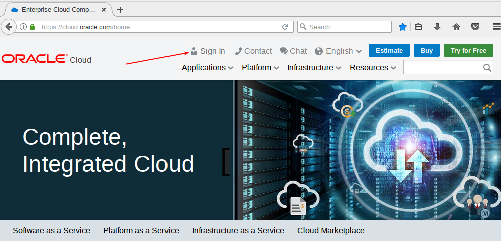

- Enter your `Cloud Account Name` and click `Next`.

  

- Enter your Cloud `username` and `password`, and click `Sign In`.

  

### **STEP 2: Create an ADWC Instance**

- Select Dashboard

  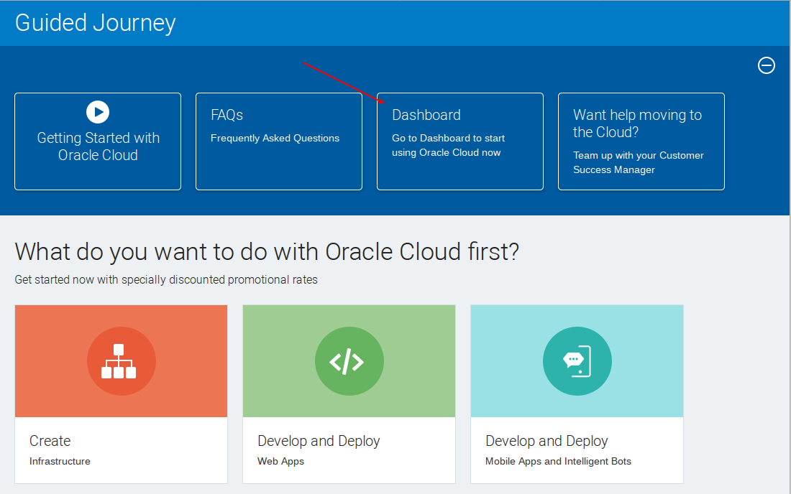

- To access Oracle Cloud Infrastructure (OCI) dashboard, click on `Customize Dashboard`.

  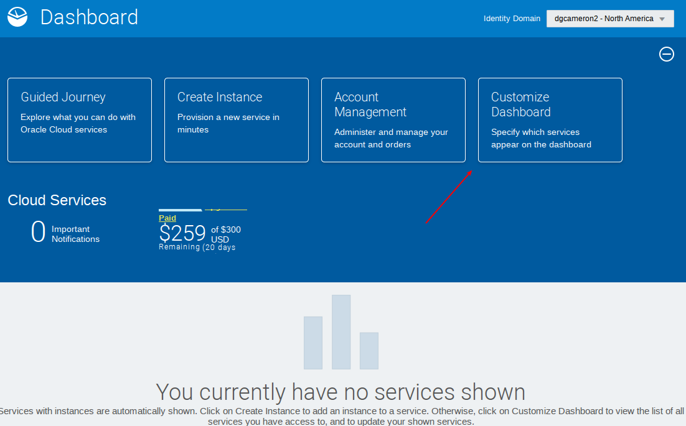

- Find `Autonomous Data Warehouse` under Data Management and click on `Show`.

  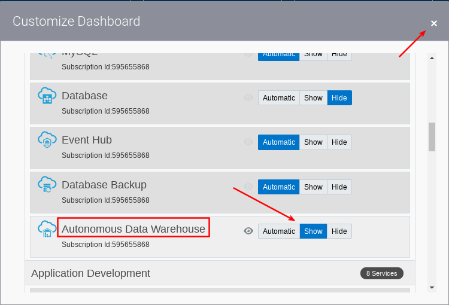

- Select Autonomous Data Warehouse.

  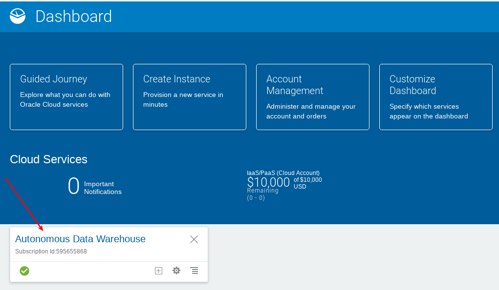

- Select Open Service Console.

  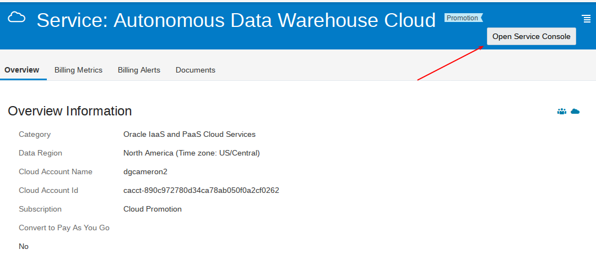

- Select Create Autonomous Data Warehouse

  

- Enter Select `Compartment` (yours will be different - do not select `ManagedCompartmentforPaaS`) and then enter `Display Name`, `Database Name`, and increase the core count to 2.  Note you can also increase storage, but leave this as is for now.

  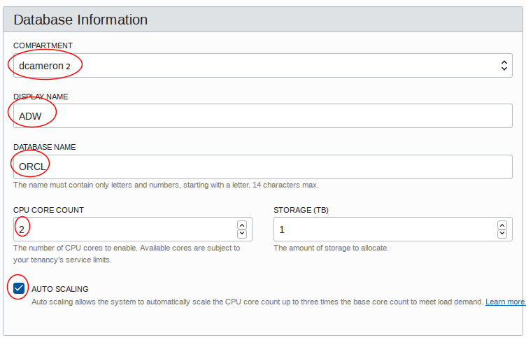

- Add a password (`Alpha2018___` three underscores) and then select Create Autonomous Data Warehouse.

  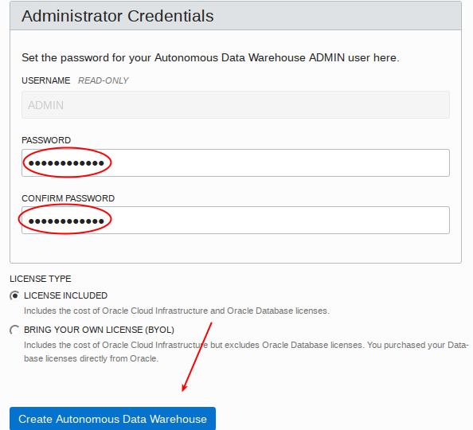

- Once it finishes provisioning, you can click on the instance name to see details of it

  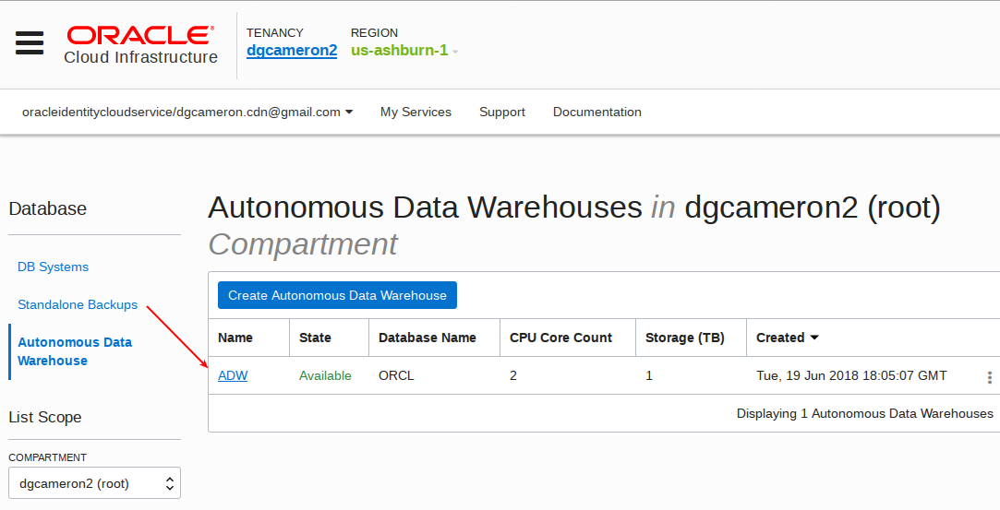

  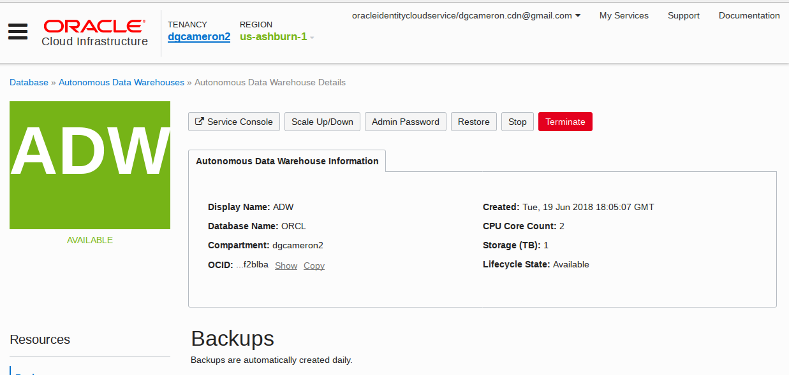

You now have created your first Autonomous Data Warehouse Cloud instance.

## Connecting to ADWC

As ADWC only accepts secure connections to the database, you need to download a wallet file containing your credentials first. The wallet is downloaded from the ADWC service console.

### **STEP 3: Sign in to the Service Console**

- In the instance details page find your database and click `Service Console`. 

  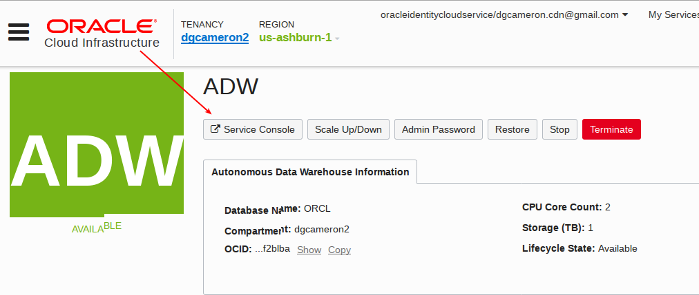

### **STEP 4: Download the credentials wallet**

- Click on `Administration` and click `Download a Connection Wallet` to download the wallet.

  

  

- Specify a password of your choice for the wallet (eg `Alpha2018___`), you will need this password when connecting to the database later. Click `Download` to download the wallet file to your client machine.

    

## Connecting to the database using SQL Developer
Start SQL Developer (18.3) and create a connection for your database using the default administrator account, ADMIN, by following these steps.

### **STEP 5: Connect to the database using SQL Developer**

- Click the **Create Connection** icon in the Connections toolbox on the top left of the SQL Developer homepage.

  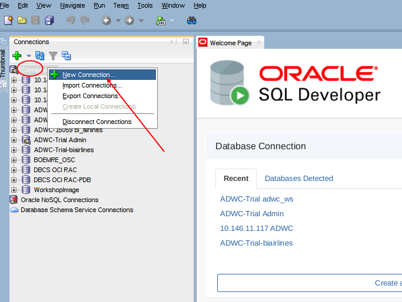

- Fill in the connection details as below:
  - **Connection Name:** `ADWC-Trial Admin`
  - **Username:** `admin`
  - **Password:** The password you specified during provisioning (`Alpha2018___`)
  - **Connection Type:** `Cloud PDB`
  - **Configuration File:** Enter the full path for the wallet file you downloaded before, or click the `Browse` button to point to the location of the file.
  - **Service:** There are 3 pre-configured database services for each database. Pick `orcl_high` for this lab.

    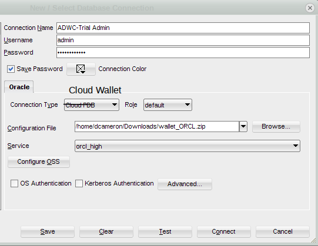

- Test your connection by clicking the **Test** button, if it succeeds save your connection information by clicking `Save`, then connect to your database by clicking the `Connect` button. An entry for the new connection appears under Connections.

  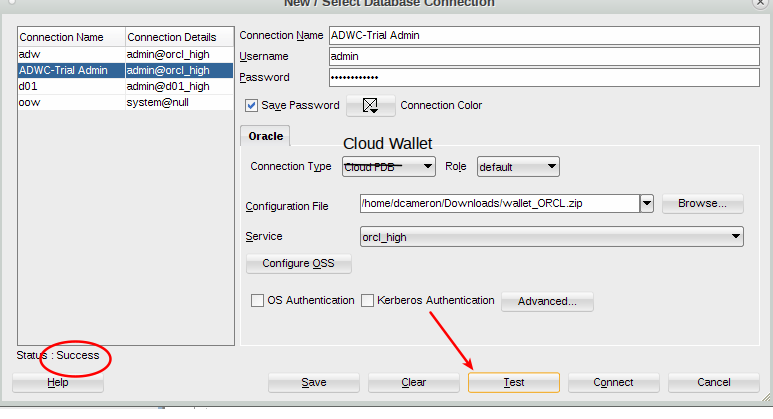

### **STEP 6: Create a sample sub-set of the lineorder data.  Note this will take approximately one hour.**

- In preparation for Lab 200 we will create the current year data set, which is a subset of the 6 billion row data set (100 million rows).  Enter the following in SQLDeveloper.  Note this will take approximately one hour.  Take a break before lab 200 :).
```
begin
--
dbms_scheduler.create_job( 
job_name => 'load_data',
job_type => 'PLSQL_BLOCK',
job_action => 'begin ' ||
' execute immediate ''create table lineorder_100m as select * from ssb.lineorder sample(1.66667)''; ' ||
' execute immediate ''create table customer as select * from ssb.customer where c_custkey in (select lo_custkey from lineorder_100m)''; ' ||
' execute immediate ''create table part as select * from ssb.part where p_partkey in (select lo_partkey from lineorder_100m)''; ' ||
' execute immediate ''create table supplier as select * from ssb.supplier where s_suppkey in (select lo_suppkey from lineorder_100m)''; ' ||
' execute immediate ''create table dwdate as select * from ssb.dwdate''; ' ||
' execute immediate ''grant select any table to public''; ' ||
'end;',
enabled => true );
end;
/  
```
- To periodically monitor the job run the following in SQLDeveloper.

  `select * from USER_SCHEDULER_JOBS;`

- When the job disappears from the query above it has completed.  You can confirm it ran successfully by running the following.

  `select * from user_scheduler_job_run_details;`

- Note these must complete before moving on to Lab 200.

### **STEP 7: Initiate the creation of an Autonomous Analytic Cloud service.  Note this will take approximately two hours, but will not be needed till Lab 400.**

- Go to the menu in the upper left, select `Identity`, and then `Users`.

  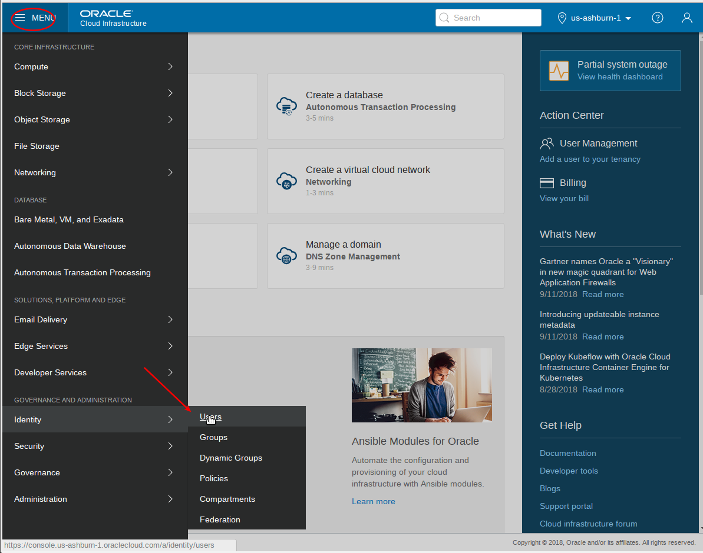

- Select the user.

  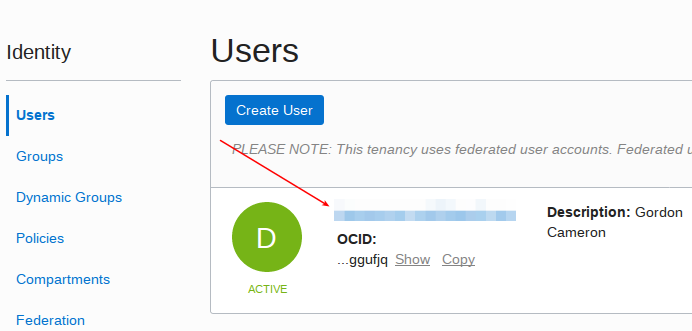

- Select `Auth Tokens` on the left and then `Generate Token`.

  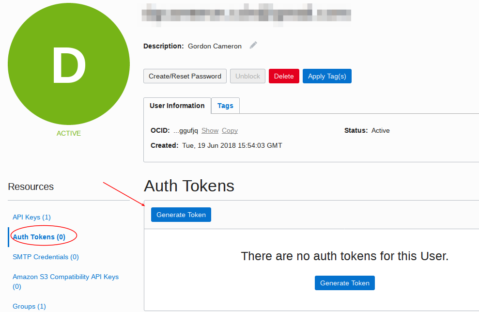

  

- Be sure to copy the generated token to a notepad.  You will need it when creating an OAC instance.

  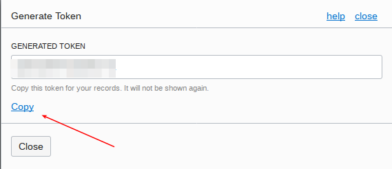

- Next go back to the menu in the top left and select `Object Storage`.  

  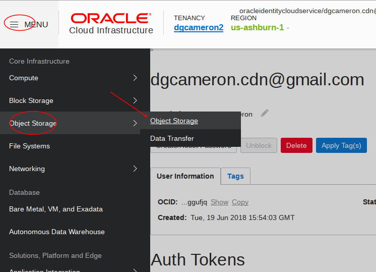

- Create a new bucket - call it `oac`.

  

  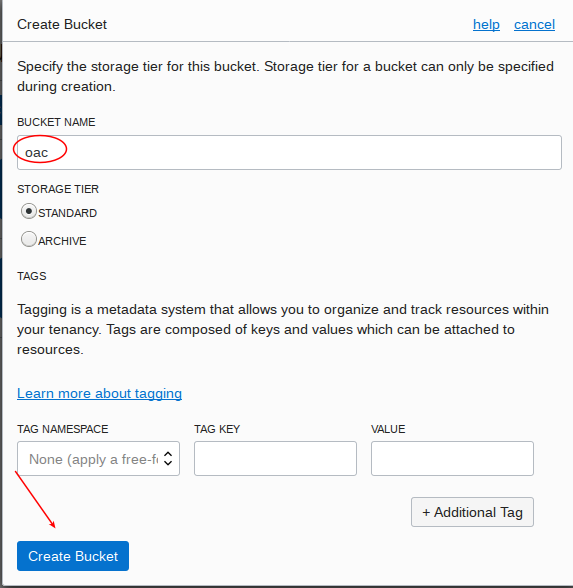

- Now we will create a new Autonomous Oracle Analytic Service.  Select `My Service Dashboard` from the top left menu.

  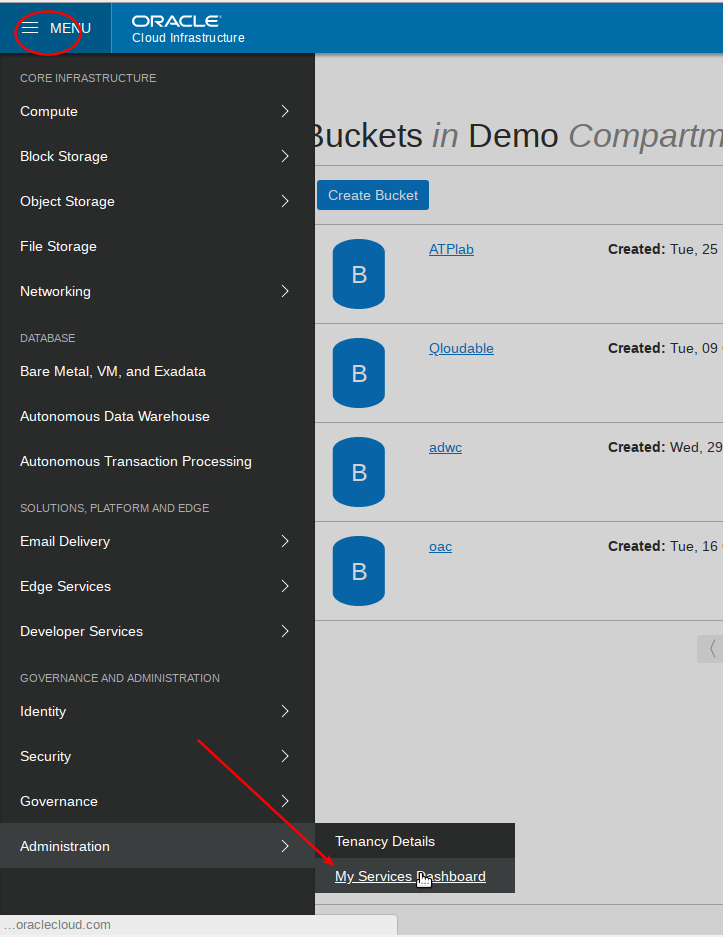

- Select `Autonomous Analytics`.  You may need to customize the dashboard to make the service visible.

  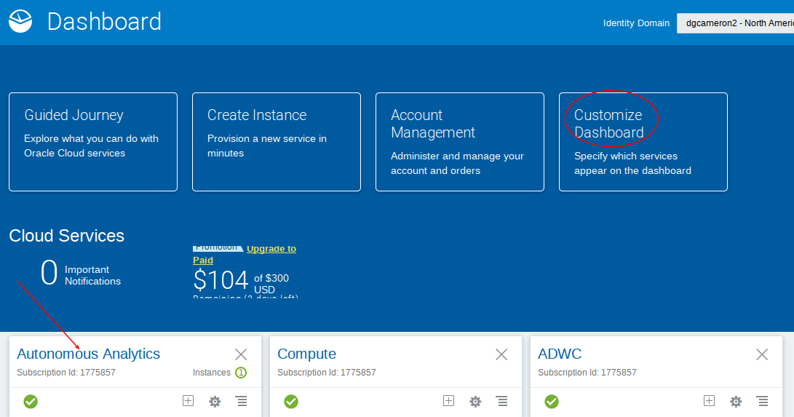

  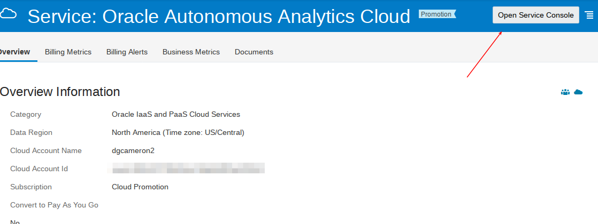

- Create instance.

  

- Enter the following details and select `Next`, and then `Create`.

  

  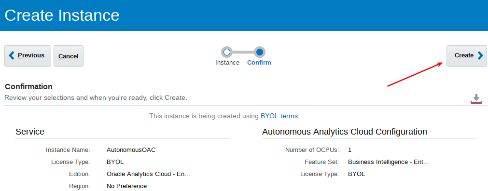

## Conclusion
Vijay found that creating a new ADWC service very very easy, and took only a couple of minutes to create.  Connecting was straightforward using SQL Developer.

You can now move on to the next lab.