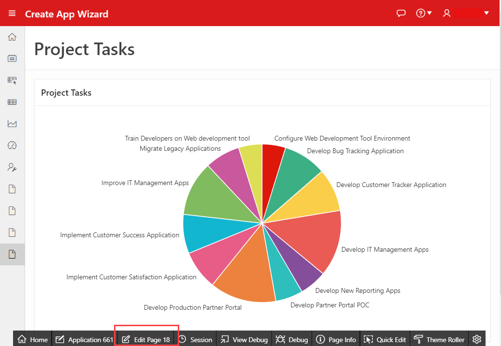
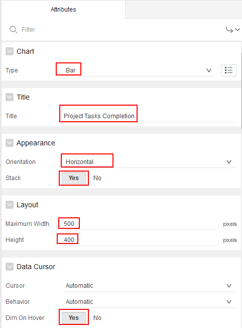
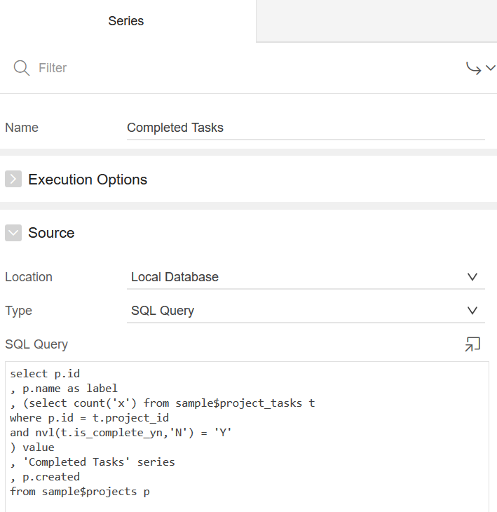
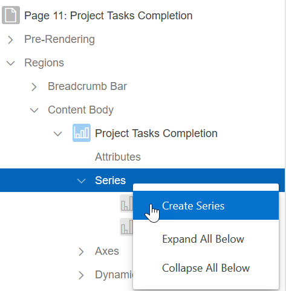
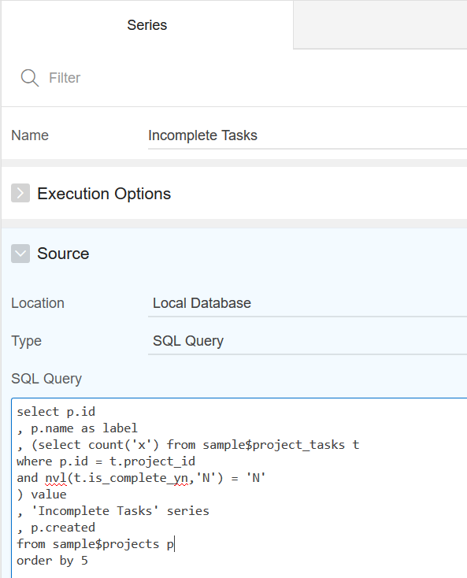
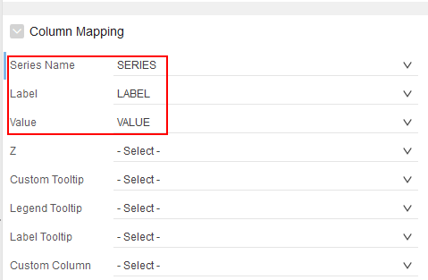
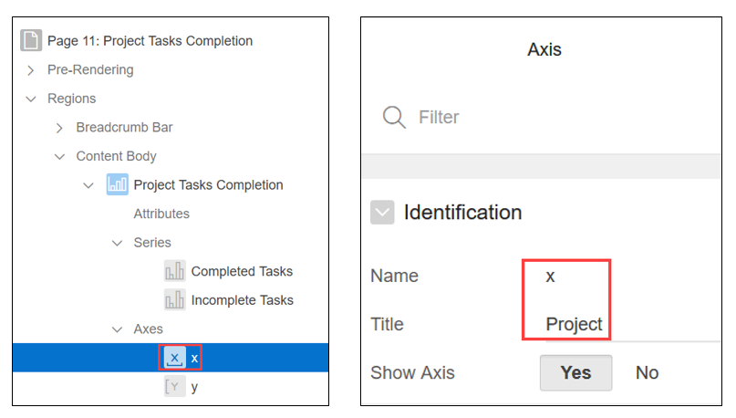
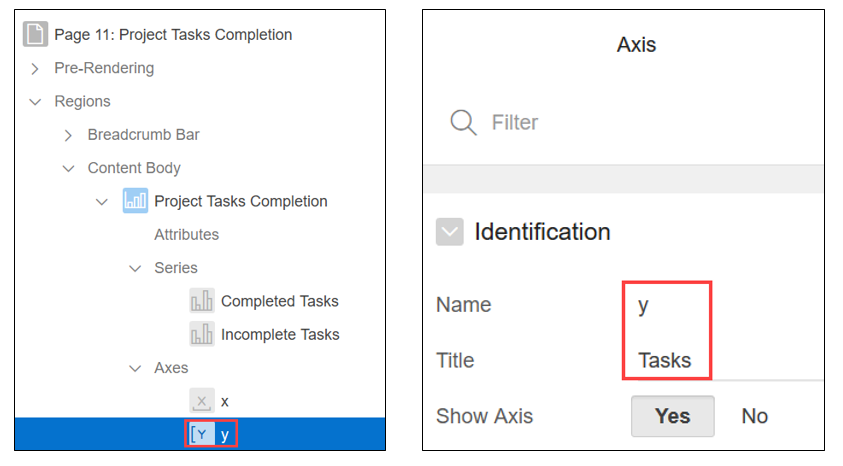
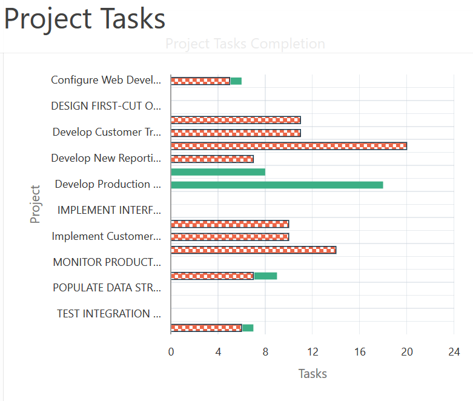

# Oracle Application Express 18: Charts (2 of 3) - Adding a Bar Chart
## Before You Begin

This 15-minute tutorial shows you how to edit a chart. This is the second tutorial in the series _Oracle Application Express 18: Charts._

### Background

In this tutorial, you will learn how to edit the pie chart _Project Tasks_ that you created in the first tutorial in this series. You will learn how to:

*   Update the data source of the chart
*   Edit the chart attributes
*   Switch chart type from pie chart to a bar chart
*   Change chart orientation

### What Do You Need?

To complete this tutorial, you need to:

*   Complete the preceding tutorials in this series.

### Accessing your Development Environment

How you sign in and access Oracle Application Express depends upon where Oracle Application Express resides. Oracle Application Express may reside in a local on-premises Oracle Database or in a hosted environment, such as the Oracle Cloud. The sign in credentials you use to sign in differ depending upon the installation type.

**Free Workspace:** Give Oracle Application Express a test run by signing up for a free workspace. To request an evaluation workspace, go to [apex.oracle.com](https://apex.oracle.com/en/), and click **Get Started for Free.**

**Oracle Cloud:** Develop and deploy applications without worrying about infrastructure, repair, and downtime. Oracle Application Express is available in Exadata Express Cloud Service and Database Cloud Service. However, you need to manually customize your databases to install and enable Oracle Application Express. To learn more, see [Oracle Database Cloud Service](https://cloud.oracle.com/database).

**Oracle Application Express On-premises:** Install Oracle Application Express directly within any Oracle Database and then sign in to your workspace using your sign in credentials. For details on your sign in credentials, contact your administrator or see [Oracle Application Express Installation Guide](http://www.oracle.com/pls/topic/lookup?ctx=E89503-01&id=HTMIG363).

**Oracle Application Express Pre-Built VM:** Install a Pre-Built Virtual Machine (VM) which includes an Oracle Database and Oracle Application Express 18.1\. To learn more, see [Hands-On Lab](http://www.oracle.com/technetwork/developer-tools/apex/learnmore/apex-hols-2578401.html).  

Once the VM is installed, start the VM:

1. Click the big red circle labeled Start.

2. Click the APEX shortcut, or enter the following URL: `http://localhost:8080/ords/f?p=4550:1`

3. When prompted to sign in, enter the sign in credentials (unless given other credentials to use):

    *   Workspace: `obe`
    *   Username: `obe`
    *   Password: `oracle`

Note your Application ID may be different when compared to the screenshots in this tutorial. Your Application ID is assigned automatically when you create the application.


* * *

## Adding a Bar Chart to an Existing Page

In the first tutorial of this series, you created the pie chart _Project Tasks._In this tutorial, you will learn how to you add a bar chart to the existing page _Project Tasks_ by using Page Designer.

To add a bar chart:

1.  In the Create App Wizard application, go to the Project Tasks page. In the Developer toolbar of the page, click **Edit Page 18.** The _Project Tasks_ page opens in Page Designer.  

    

2.  In the Rendering tab, click **Attributes.** On the right pane, specify the following attributes in the Attributes tab:

    *   **Type:** Select **Bar**
    *   **Title:** Enter **Project Tasks Completion/span>**

4.  In the Appearance section, specify the following:

    *   **Orientation:** Select **Horizontal**
    *   **Stack:** Select **Yes**

6.  In the **Layout** section, specify the following:

    *   **Maximum Width:** Enter **500**
    *   **Height:** Enter **400**

8.  In the **Data Cursor** section, click **Yes** for Dim On Hover. 

    


10.  In the Rendering tab, click **Series1** under Series. On the right pane, in the **Identification** tab, enter the following:

    *   **Name:** Enter **Completed Tasks**
    *   **SQL Query:** Enter the following code:

    ```
select p.id  
, p.name as label  
, select count('x') from sample$project_tasks t  
where p.id = t.project_id  
and nvl(t.is_complete_yn,'N') = 'Y'   
) value  
, 'Completed Tasks' series  
, p.created  
from sample$projects p  
    ```

    


12.  In the Rendering tab, right click **Series** and click **Create Series.**

    

    On the right pane, in the **Identification** tab, enter the following:

    *   **Name:** Enter **Incomplete Tasks**
    *   **SQL Query:** Enter the following code:  
    ```
	select p.id  
    , p.name as label  
    , (select count('x') from sample$project_tasks t  
    where p.id = t.project_id  
    and nvl(t.is_complete_yn,'N') = 'N'  
    ) value  
    , 'Incomplete Tasks' series  
    , p.created  
    from sample$projects p  
    order by 5
	```

    


14.  In the Column Mapping section for the series Completed Tasks and Incomplete Tasks, specify the following:

    *   **Series Name:** Select **SERIES**
    *   **Label:** Select **LABEL**
    *   **Value**: Select **VALUE**

    


16.  In the Rendering tab, under Axes, define the attributes for x axis and y axis of the bar chart Project Tasks Completion.

    *   Click **x** under Axes node in the Rendering tab. On the right pane under the Identification tab, enter **Projects** for Title.

    

    *   Click **y** under Axes node in the Rendering tab. On the right pane under the Identification tab, enter **Tasks** for Title.

    


18.  Click **Save** and then click **Run.** The bar chart _Project Tasks_ is generated, as shown in the screenshot. The projects are plotted along the y axis, and the tasks are plotted along the x axis. Since this is a stacked bar chart, the completed tasks and incomplete tasks are stacked in the same bar chart, and distinguished by green and red colored segments respectively. 

    

* * *

## Next Tutorial

[Oracle Application Express 18: Charts (3 of 3) - Changing Chart Appearance with JavaScript](?chart-custom-js)

* * *

## Want to Learn More?

*   [Creating Charts](http://www.oracle.com/pls/topic/lookup?ctx=E89503-01&id=HTMDB-GUID-50985225-4C89-489B-B019-E2D91E61428A)

* * *