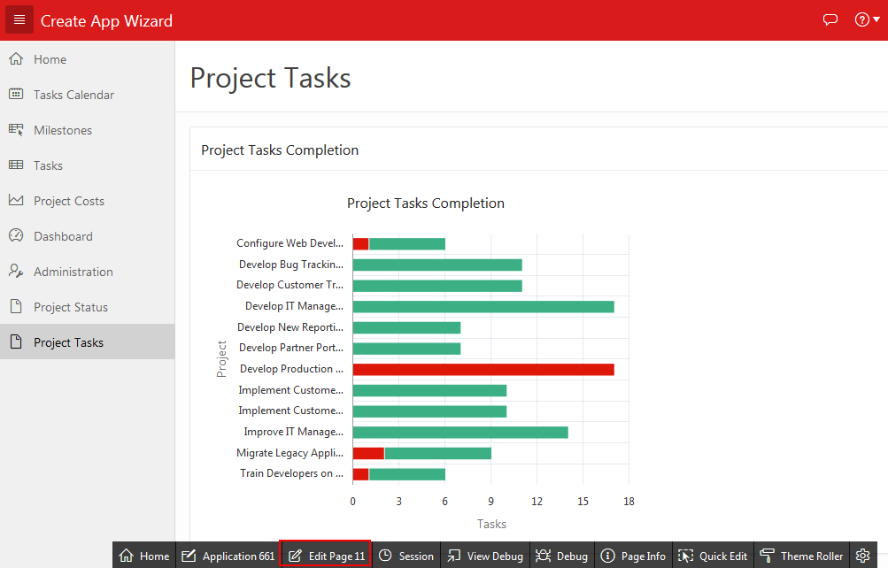
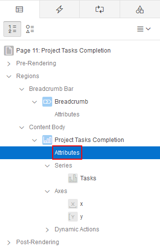
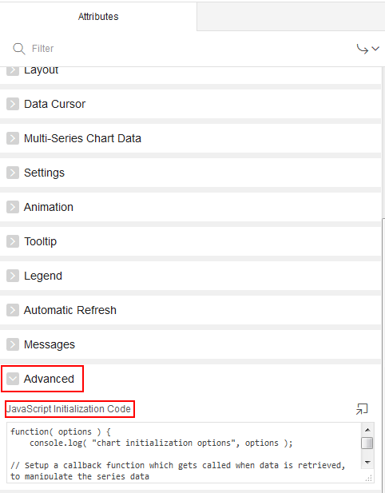
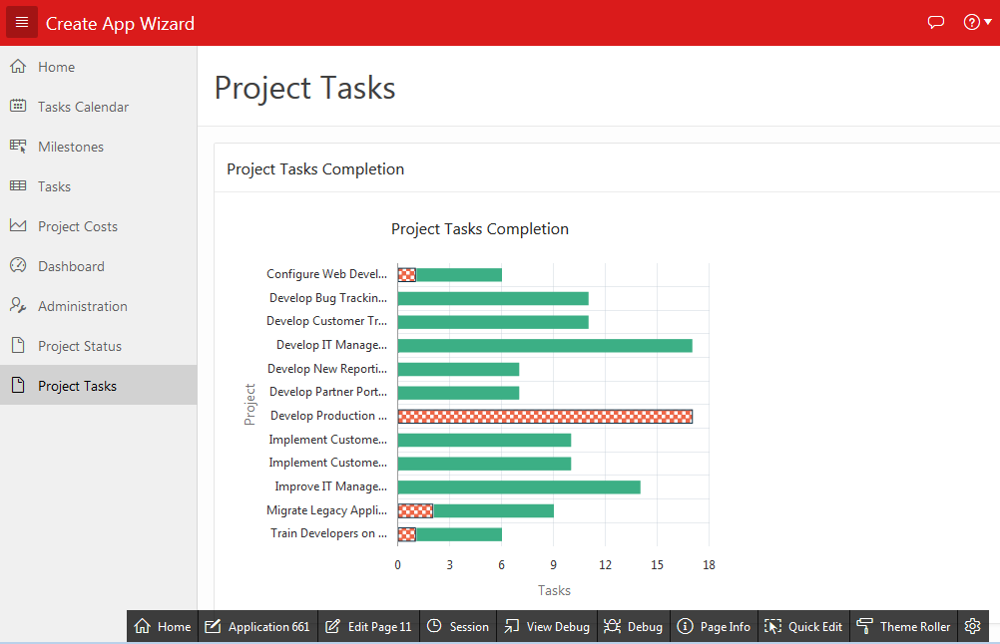

# Oracle Application Express 18: Charts (3 of 3) - Changing Chart Appearance with JavaScript

## Before You Begin

This 5 -minute tutorial shows you how to create a custom JavaScript to change the appearance of a chart. This is the third and the last tutorial in the series _Oracle Application Express 18: Charts._

### Background

In the third tutorial in this series, you created a dynamic action for the _Project Tasks Completion_ chart. In this tutorial, you will learn how to use a JavaScript to change the appearance of the _Project Tasks Completion_ chart.  

### What Do You Need?

To complete this tutorial, you need to:

*   Complete the preceding tutorials in this series.

### Accessing your Development Environment

How you sign in and access Oracle Application Express depends upon where Oracle Application Express resides. Oracle Application Express may reside in a local on-premises Oracle Database or in a hosted environment, such as the Oracle Cloud. The sign in credentials you use to sign in differ depending upon the installation type.

**Free Workspace:** Give Oracle Application Express a test run by signing up for a free workspace. To request an evaluation workspace, go to [apex.oracle.com](https://apex.oracle.com/en/), and click **Get Started for Free.**

**Oracle Cloud:** Develop and deploy applications without worrying about infrastructure, repair, and downtime. Oracle Application Express is available in Exadata Express Cloud Service and Database Cloud Service. However, you need to manually customize your databases to install and enable Oracle Application Express. To learn more, see [Oracle Database Cloud Service](https://cloud.oracle.com/database).

**Oracle Application Express On-premises:** Install Oracle Application Express directly within any Oracle Database and then sign in to your workspace using your sign in credentials. For details on your sign in credentials, contact your administrator or see [Oracle Application Express Installation Guide](http://www.oracle.com/pls/topic/lookup?ctx=E89503-01&id=HTMIG363).

**Oracle Application Express Pre-Built VM:** Install a Pre-Built Virtual Machine (VM) which includes an Oracle Database and Oracle Application Express 18.1\. To learn more, see [Hands-On Lab](http://www.oracle.com/technetwork/developer-tools/apex/learnmore/apex-hols-2578401.html).

Once the VM is installed, start the VM:

1. Click the big red circle labeled Start.
2. Click the APEX shortcut, or enter the following URL: `http://localhost:8080/ords/f?p=4550:1`
3. When prompted to sign in, enter the sign in credentials (unless given other credentials to use):

    *   Workspace: `obe`
    *   Username: `obe`
    *   Password: `oracle`

Note your Application ID may be different when compared to the screenshots in this tutorial. Your Application ID is assigned automatically when you create the application.


## Using a Custom JavaScript in the Chart

To change the appearance of the _Project Tasks Completion_ chart using a Javascript:

1.  On the Developer toolbar of the _Project Tasks Completion_ chart, click **Edit Page 11.** The _Project Tasks Completion_ page opens in Page Designer. 

    

2.  In the Rendering tree, select the **Attributes** node under Project Tasks Completion.

        

3.  Scroll down the Attributes pane on the right pane, and locate the **Advanced** section.

    

4.  Under **Advanced,** enter the following code in the **JavaScript Initialization Code** field:

    ```
	function( options ) {  
        console.log( "chart initialization options", options );  
        // Setup a callback function which gets called when data is retrieved, to manipulate the series data  
        options.dataFilter = function( data ) {  
            data.series[ 0 ].color = "#ED6647";  
            data.series[ 0 ].borderColor = "#0F3248";  
            data.series[ 0 ].markerDisplayed = "on";  
            data.series[ 0 ].markerShape = "plus";  
            data.series[ 0 ].markerColor = "red";  
            data.series[ 0 ].markerSize = 8;  
            data.series[ 0 ].pattern = "smallChecker";  
            return data;  
        };  
        return options;  
    }
	```

5.  Click **Save** and then run the page.

6.  The _Project Tasks Completion_ chart is now displayed with the new appearance, as shown in the screenshot. As in the original chart, the projects are plotted along the x axis, and the tasks are plotted along the y axis. Since this is a stacked bar chart, the completed tasks and incomplete tasks are stacked in the same bar chart, and distinguished by green and red colored segments respectively. In the new look, red segment in the stacked bar chart has now changed to white and red colored checkered segments.  

    


## Want to Learn More?

*   [Creating Charts](http://www.oracle.com/pls/topic/lookup?ctx=E89503-01&id=HTMDB-GUID-50985225-4C89-489B-B019-E2D91E61428A)