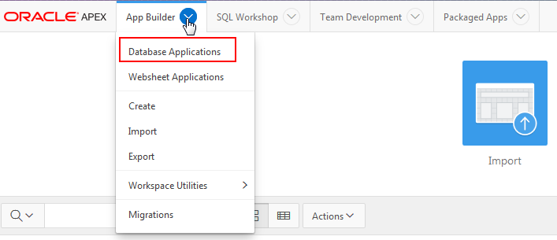
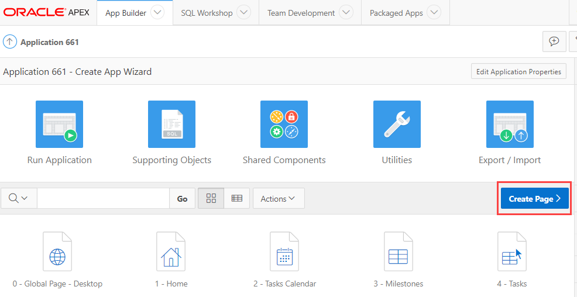
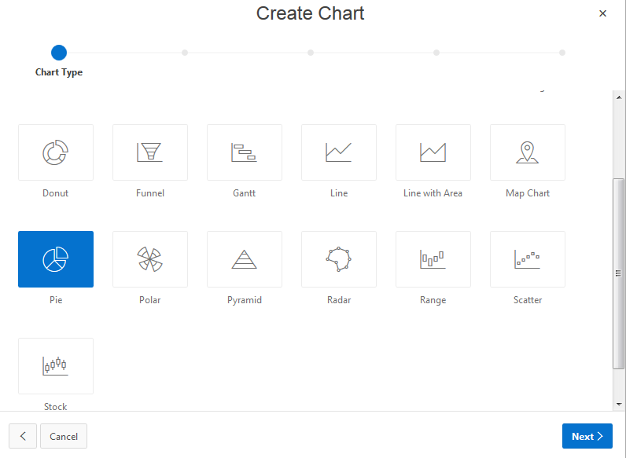
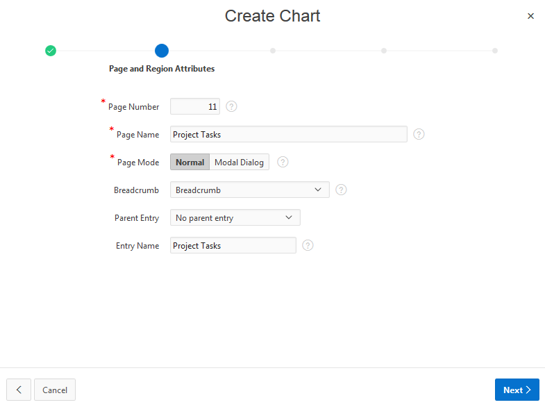
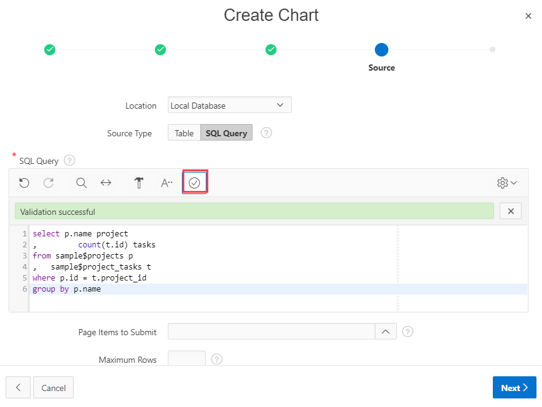
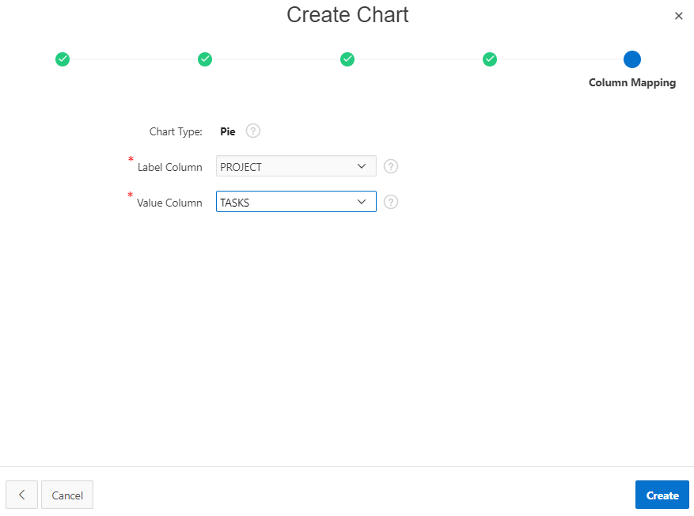
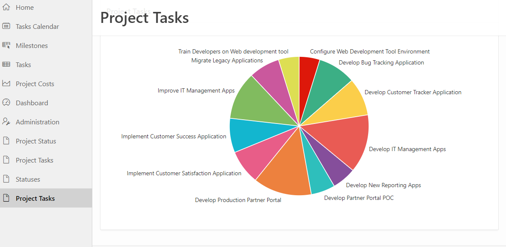

#Oracle Application Express 18: Charts (1 of 3) - Adding a Pie Chart
## Before You Begin

This 5 minute tutorial shows you how to create a pie chart in a new page in an application. This is the first tutorial in the series _Oracle Application Express 18: Charts._ Read in the tutorials in sequence:

*   Oracle Application Express 18: Charts (1 of 3) - Adding a Pie Chart
*   [Oracle Application Express 18: Charts (2 of 3) - Adding a Bar Chart](?piechart2)
*   [Oracle Application Express 18: Charts (3 of 3) - Changing Chart Appearance with JavaScript](?piechart3)

### Background

Charts provide different ways to visualize a data set, including bar, line, area, range, combination, scatter, bubble, polar, radar, pie chart, donut, funnel, and stock charts.

In this tutorial, you will learn how to create a pie chart and add it to the application _Create App Wizard._

**Note:** The _Create App Wizard_ is the app that you created in the tutorial Oracle Application Express 18: Create Application Wizard (2 of 2). 

### What Do You Need?

To complete this tutorial, you need to:

*   Access to Oracle Application Express 18.1 or later
*   Access to an Oracle Database 11g or later release, either on-premise or Database Cloud Service
*   Complete the tutorial [Oracle Application Express 18: Create Application Wizard (2 of 2) - Running the Wizard](http://apexapps.oracle.com/pls/apex/f?p=44785:112:0::::P112_CONTENT_ID:24557) and build the app _Create App Wizard_

### Accessing your Development Environment

How you sign in and access Oracle Application Express depends upon where Oracle Application Express resides. Oracle Application Express may reside in a local on-premises Oracle Database or in a hosted environment, such as the Oracle Cloud. The sign in credentials you use to sign in differ depending upon the installation type.

**Free Workspace:** Give Oracle Application Express a test run by signing up for a free workspace. To request an evaluation workspace, go to [apex.oracle.com] (https://apex.oracle.com/en/), and click **Get Started for Free**.

**Oracle Cloud:** Develop and deploy applications without worrying about infrastructure, repair, and downtime. Oracle Application Express is available in Exadata Express Cloud Service and Database Cloud Service. However, you need to manually customize your databases to install and enable Oracle Application Express. To learn more, see [Oracle Database Cloud Service](https://cloud.oracle.com/database).

**Oracle Application Express On-premises:** Install Oracle Application Express directly within any Oracle Database and then sign in to your workspace using your sign in credentials. For details on your sign in credentials, contact your administrator or see [Oracle Application Express Installation Guide](http://www.oracle.com/pls/topic/lookup?ctx=E89503-01&id=HTMIG363).

**Oracle Application Express Pre-Built VM:** Install a Pre-Built Virtual Machine (VM) which includes an Oracle Database and Oracle Application Express 18.1\. To learn more, see [Hands-On Lab](http://www.oracle.com/technetwork/developer-tools/apex/learnmore/apex-hols-2578401.html). 

Once the VM is installed, start the VM:

1.  Click the big red circle labeled Start.

2.  Click the APEX shortcut, or enter the following URL: `http://localhost:8080/ords/f?p=4550:1`

3.  When prompted to sign in, enter the sign in credentials (unless given other credentials to use):

    *    Workspace: `obe`
    *    Username: `obe`
    *    Password: `oracle`

Note your Application ID may be different when compared to the screenshots in this tutorial. Your Application ID is assigned automatically when you create the application.


* * *

## Add a Chart in an Application

To add a new chart to the Create App Wizard application:

1.  In the Oracle Application Express home page, click the down arrow next to App Builder and click Database Applications.  

    

2.  Select the **Create App Wizard** application and click **Create Page.** 
    **Note:** The _Create App Wizard_ is the application that you created in the tutorial _Oracle Application Express 18.1: Using the Create Application Wizard (2 of 2)._   

    

3.  In the Create a Page dialog, select **Chart** and click **Next.** The Create Chart wizard opens.
4.  In the **Chart Type** section of the Create Chart wizard, select **Pie** and click **Next.**

    

5.  In the **Page and Region Attributes** section of the wizard, enter the following attributes to define the page and click **Next.**

    *   **Page Name:** Enter**Project Tasks**
    *   **Page Mode:** Select **Normal**
    *   Select **Breadcrumb**

    

7.  In the Navigation Preference section, select **Create a new navigation menu entry** and click **Next.**

8.  In the **Source** section of the wizard, enter the following to define the data source for the pie chart:

    *   **Location:** Select **Local Database**
    *   **Source Type:** Select **SQL Query** and enter the following SQL code:

    ```
select p.name project , count(t.id) tasks from sample$projects p, 
sample$project_tasks t where p.id = t.project_id group by p.name
    ```

    *   Click the **Validate** icon

    

10.  In the **Column Mapping** section of the wizard, enter the following:

    *   **Label Column:** Select **PROJECT**
    *   **Value Column:** Select **TASK**

    

12.  Click **Create.** The _Project Tasks_ page is created and added to the _Create App Wizard_ application. The page opens in Page Designer. 

13.  In Page Designer, click the **Run** icon to run and view the _Project Tasks_ page in the application _Create App Wizard.  
    _In the _Project Tasks_ page, twelve tasks are depicted in the pie chart along with the task names, as shown in the screenshot.

    

    **Note:** You can also add charts using Page Designer.

* * *

## Next Tutorial

[Oracle Application Express 18: Charts (2 of 3) - Adding a Bar Chart](?piechart2)

* * *

## Want to Learn More?

*   [Adding a Chart in Page Designer](http://www.oracle.com/pls/topic/lookup?ctx=E89503-01&id=HTMDB-GUID-0CC50B5B-1353-4C3E-B54E-092C18F4E22C)

* * *