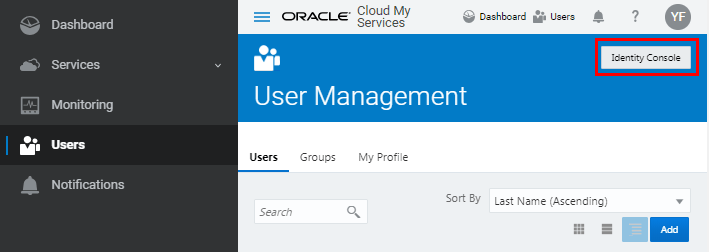

# Create a Table in Oracle NoSQL Database Cloud Service Using Java
## Before You Begin

This 15-minute tutorial walks you through the steps to connect to Oracle NoSQL Database Cloud Service and create a table using a sample application.

### Background

Oracle NoSQL Database Cloud Service is a fully managed database cloud service that is designed to handle large amounts of data at high velocity. Developers can start using this service in minutes by following the simple steps outlined in this tutorial.

To get started with the service, you create a table.

After you subscribe to Oracle Cloud, you can easily populate a table in the Oracle NoSQL Database Cloud Service by following these steps:

*   Copying client credentials
*   Updating your application with the credentials
*   Executing the application to connect to the service and creating a table

### What Do You Need?

*   Download and install the Oracle NoSQL Database Cloud Service Java Driver from the [Oracle Technology Network](http://www.oracle.com/technetwork/topics/cloud/downloads/index.html#nosqlsdk).
*   Access the [Java API Reference Guide](https://docs.oracle.com/en/cloud/paas/nosql-cloud/csnjv/index.html) to reference Java driver packages, methods, and interfaces.
*   Have an Oracle Cloud subscription with account administrator or application administrator privilege. You can either create a [free trial account](https://cloud.oracle.com/en_US/tryit) or buy a [paid subscription](https://myservices.us.oraclecloud.com/mycloud/signup?selectedPlan=PAYG&language=en&sourceType=_ref_coc-asset-opcHome) by navigating to [cloud.oracle.com](https://cloud.oracle.com/en_US/nosql).
*   Perform the steps in the [Get Started with Oracle NoSQL Database Cloud Service tutorial](https://apexapps.oracle.com/pls/apex/f?p=44785:112:::NO::P112_CONTENT_ID:24207).

* * *

## Access Client Credentials

To connect your application to the Oracle NoSQL Database Cloud Service, you should obtain the client id, client secret, and IDCS URL.

Perform the following steps to find your client credentials. Save these credentials in an editor of your choice. You will need them to update the `HelloWorld.java` application in the next section.

1.  Sign in to your Oracle Cloud account by accessing the link from your welcome email.
2.  The Oracle Cloud My Services page opens up for you.

    

3.  To access the Identity Console, click  and then click Users. In the User Management page, click Identity Console.

    

4.  In the Oracle Identity Cloud Services page, click  and then click Applications.

    

5.  In the Applications page, click **NoSQLClient**.

    If **NoSQLClient** is not listed in the applications page, you must perform the steps in the Access Client Credentials section of the [Get Started with Oracle NoSQL Database Cloud Service tutorial](https://docs.oracle.com/en/cloud/paas/nosql-cloud/gsans/index.html#AccessClientCredentials).

6.  In the NoSQLClient application page, click **Configuration**. From the **General Information** section, obtain the **Client ID** and **Client Secret** credentials.

7.  Next, copy the IDCS URL from the browser’s address bar. Copy up to **_https://idcs-xxx.identity.oraclecloud.com_**. Paste the URL to the text file for use in the next step.

* * *

## Update the Sample Application

1.  Copy the `HelloWorld.java` application to an editor of your choice. You will be using this application to connect to Oracle NoSQL Database Cloud Service and create a table.

    You can access the [Java API Reference Guide](https://docs.oracle.com/en/cloud/paas/nosql-cloud/csnjv/index.html) to reference Java classes, methods, and interfaces included in this sample application.

```
import java.net.URL;
import oracle.nosql.driver.*;
import oracle.nosql.driver.idcs.*;
import oracle.nosql.driver.ops.*;
import oracle.nosql.driver.values.MapValue;

public class HelloWorld {

	/* Name of your table */
	private static final String tableName = "HelloWorldTable";

	public static void main(String[] args) throws Exception {

		...
	}

	/**
	 * Create a table and do some operations.
	 */
	private static void helloWorld(NoSQLHandle handle) throws Exception {

		...
	}

	/** Remove the table. */
	private static void dropTable(NoSQLHandle handle) throws Exception {

		...
	}

	/** Get the end point from the arguments */
	private static String getEndpoint(String[] args) {
		...
	}

	/** Return true if -drop is specified */
	private static boolean isDrop(String[] args) {
		...
	}

	/**
	 * Use this simple implementation of the CredentialsProvider interface to
	 * pass your credentials to HelloWorld. Replace the appropriate parts
	 * of MyCredentials before trying the example.
	 */
	private static class MyCredentials implements CredentialsProvider {
		...
	}
}
```

2.  Update the `MyCredentials` class. Replace the values for:
    *   `IDCS_URL` with the IDCS URL that you copied from the Identity Console
    *   `getOAuthClientCredentials` with your client id and client secret
    *   `getUserCredentials` with your user name and password
3.  Save the application as `HelloWorld.java` in your local system.

* * *

## Execute the Sample Application and Create a Table

1.  Open Command Prompt.
2.  Build the `HelloWorld.java` application. Update `oracle-nosql-cloud-java-driver-XX.XXX` with the Java driver version number that you have downloaded.

```
$ javac -cp oracle-nosql-cloud-java-driver-XX.X/lib/nosqldriver.jar \
HelloWorld.java
```

3.  Execute the application to create a table in the Oracle NoSQL Database Cloud Service. Update the java driver version and specify the endpoint for your service.
```
$ java -cp ".:oracle-nosql-cloud-java-driver-XX.X/lib/*" \
HelloWorld <endpoint URL>
```
For example:
```
$ java -cp ".:oracle-nosql-cloud-java-driver-19.4/lib/*" \
HelloWorld ndcs.uscom-east-1.oraclecloud.com
```

 Expected output:

```
Using endpoint: <endpoint URL>
Creating table HelloWorldTable
Waiting for HelloWorldTable to become active
Table HelloWorldTable is active
Wrote {"name":"Tracy","id":29}
Read {"name":"Tracy","id":29}
Dropping table HelloWorldTable
Waiting for HelloWorldTable to be dropped
Table HelloWorldTable has been dropped
```

4.  Navigate back in to the Identity Console. You will see `ANDC_helloworldtable` created in the Applications page.

    **Note:** Each table that you create in Oracle NoSQL Database Cloud Service will be prefixed with `'ANDC_'` in the Applications page.

5.  Delete the table by specifying the end point and the `-drop` option.

```
$ java -cp ".:oracle-nosql-cloud-java-driver-XX.X/lib/*" \
HelloWorld <endpoint URL> -drop
```

For example:

```
$ java -cp ".:oracle-nosql-cloud-java-driver-19.4/lib/*" \
HelloWorld ndcs.uscom-east-1.oraclecloud.com -drop
```
   Expected Output:

```
Using endpoint: <endpoint URL>
Dropping table HelloWorldTable
Waiting for HelloWorldTable to be dropped
Table HelloWorldTable has been dropped
```

* * *
## Want to Learn More?

*   [About Oracle NoSQL Database Cloud Service](http://docs.oracle.com/pls/topic/lookup?ctx=cloud&id=CSNSD-GUID-E2D61A27-24A4-4EEB-863B-B6E6C94E0B08)
*   [Oracle NoSQL Database Cloud Service page](https://cloud.oracle.com/en_US/nosql)
*   [Java API Reference Guide](https://docs.oracle.com/en/cloud/paas/nosql-cloud/csnjv/index.html)

* * *
