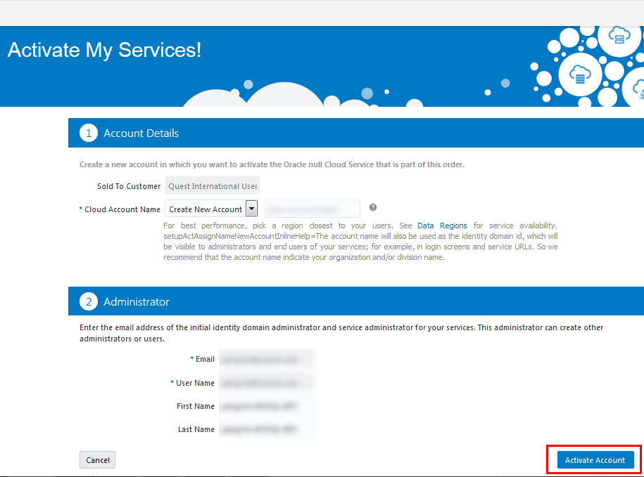
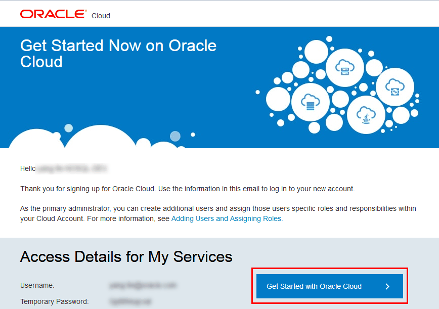
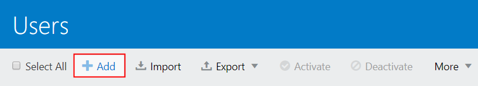
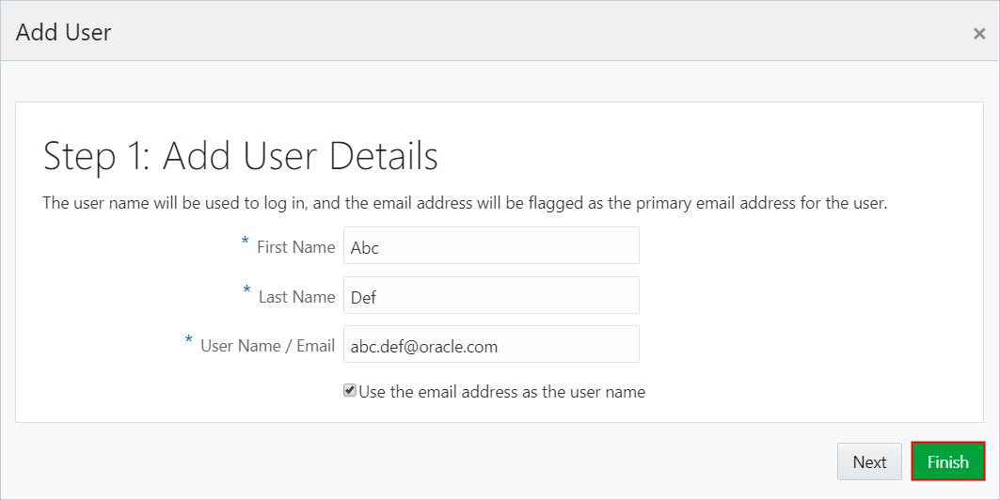
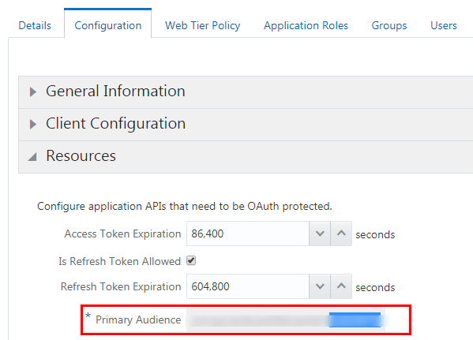
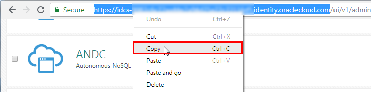

# Get Started with Oracle NoSQL Database Cloud Service
## Before You Begin

This tutorial demonstrates how to sign in to Oracle NoSQL Database Cloud Service console for the first time, create a user, and copy client credentials. This tutorial takes approximately 15 minutes to complete.

### Background
Oracle NoSQL Database Cloud Service is a fully managed database cloud service that offers low latency, flexible, scalable, high performance, and reliable data stores for document, key-value, and table data models. As it is fully managed by Oracle, it is easy to start using the service in a matter of minutes. Developers can focus on their application development and data store requirements without dealing with the complexity of maintaining a data center or purchasing servers, storage or networks.

Unlike other Oracle Cloud services, you do not create an instance to get started with Oracle NoSQL Database Cloud Service. If you are the account administrator or application administrator of your Oracle Cloud subscription, you can get started by signing in to Cloud console, creating a new user, and copying client credentials to connect your application to the service.

### What Do You Need?

* Subscription to Oracle Cloud

## Activate Your Order from Your Welcome Email

When you purchase an Oracle Cloud service, you receive a welcome email from Oracle Cloud, with you designated as an activator of the services. Perform the following steps to activate your Oracle Cloud service:

1. Open the email you received from Oracle Cloud and review the information about your service.
2. Click **Activate My Service**. 
3. In the My Account page, enter details to sign up for your new Oracle Cloud Account. 

*    For **Cloud Account Name**, insert an account name to identify your Cloud Account.
*    For **Administrator Details**, provide Cloud Account Administrator details, such as, the email, user name, first name, and last name. The person you specify here is both a Cloud Account Administrator and a Service Administrator and can create other users as required. This person manages and monitors services in the specified Cloud Account.
*    Click **Activate Account**.

    
4. After Oracle Cloud successfully activates your account, you receive another email with your login credentials. Use this information to sign in to your account. Click **Get Started with Oracle Cloud >**. 
  

5. When you first sign in to your Oracle Cloud Account, you are prompted to change your password. Change your password and re-login to Oracle Cloud with the new password. 

## Create a User in Oracle NoSQL Database Cloud Service

1. To create a user in Oracle NoSQL Database Cloud Service, from the Oracle Infrastructure Console, click   in the top corner of the page, expand **Identity**, and then click **Federation**. 

2. Click the Oracle Identity Cloud Service console link under **OracleIdentityCloudService**. The link is in the form of `https://idcs-xxxx.identity.oraclecloud.com/ui/v1/adminconsole`. 
3.  In the Oracle Identity Cloud Services page, click  and then click **Users**.
4. In the Users page, click **Add**. 
  
5. In the Add User pop-up, input the First Name, Last Name, and Email of the user. By default, the email will be used as the user name for authentication. Then, click **Finish**. 
  
6. The user is created. To grant user roles, see [Grant User Roles](https://docs.oracle.com/en/cloud/paas/nosql-cloud/csnsd/granting-roles.html).

## Access Client Credentials

To connect your application to Oracle NoSQL Database Cloud Service, obtain your credentials such as the client ID, client secret, and the entitlement ID from the Identity Cloud Service console. After obtaining the credentials, pass the credentials to your application and create tables in Oracle NoSQL Database Cloud Service. Perform the following steps:
1. From the Infrastructure Console, click  in the top corner of the page, expand I**dentity**, and then click **Federation**.
2. Click the Oracle Identity Cloud Service console link under **OracleIdentityCloudService**. The link is in the form of `https://idcs-xxxx.identity.oraclecloud.com/ui/v1/adminconsole.`
3. In the Oracle Identity Cloud Services page, click  and then click Applications. 
4. The Applications page lists the Oracle Cloud services. Click **ANDC (Autonomous NoSQL Database Cloud)**. 
5. In the ANDC page, click the **Configuration** tab and expand **General Information**. Credentials such as the Client ID and Client Secret are visible to you. Click **Show Secret**. A pop-up dialog box appears displaying the Client Secret. Copy these credentials to a new text file in your text editor. 
6. In the same page, expand **Resources**. You see the entitlement ID displayed in the Primary Audience text box, along with other values. Copy only the entitlement ID value (highlighted in blue). Paste the value into the same text file. 
  
7. Next, copy the Identity Cloud Service URL from the browser address bar. Copy up to **https://idcs-xxx.identity.oraclecloud.com** as highlighted on the screen. Paste the URL to the same text file where you have the other values.

You can now use these credentials to connect to Oracle NoSQL Database Cloud Service.

## Want to Learn More?

* [Oracle NoSQL Database Cloud Service overview](https://www.youtube.com/watch?v=zNKxJjkq0Pw&feature=youtu.be)
* [Using Oracle NoSQL Database Cloud Service](https://www.oracle.com/database/nosql-cloud.html)