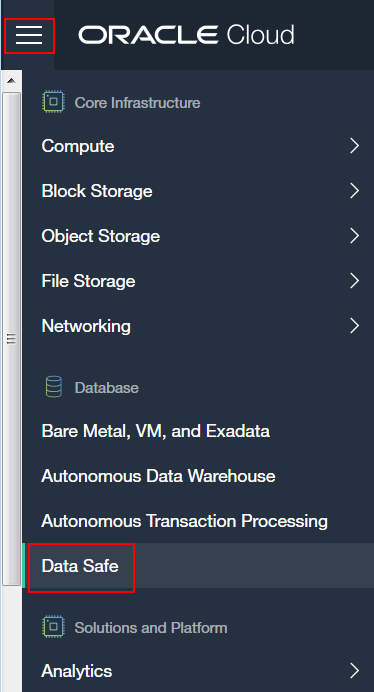
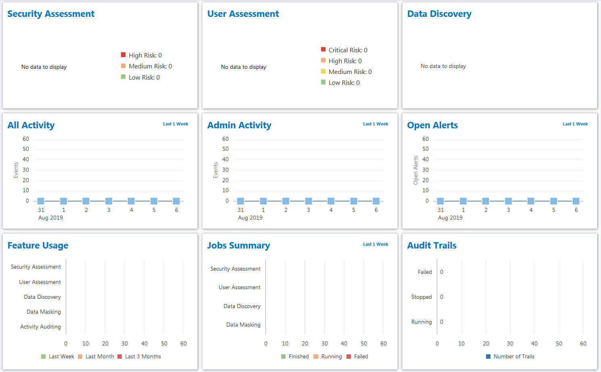
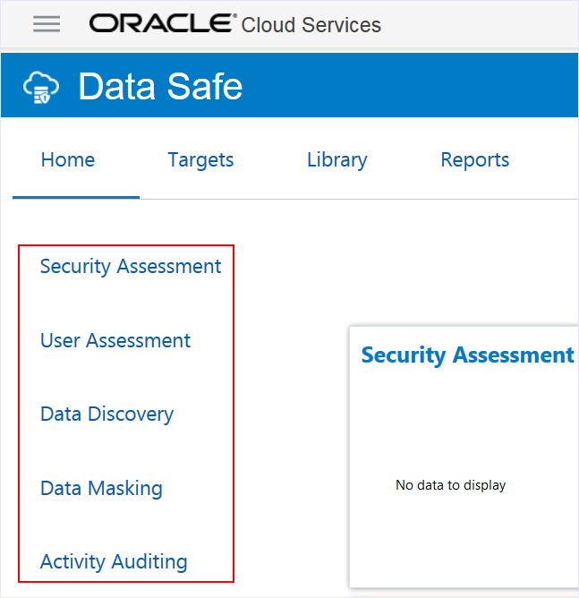
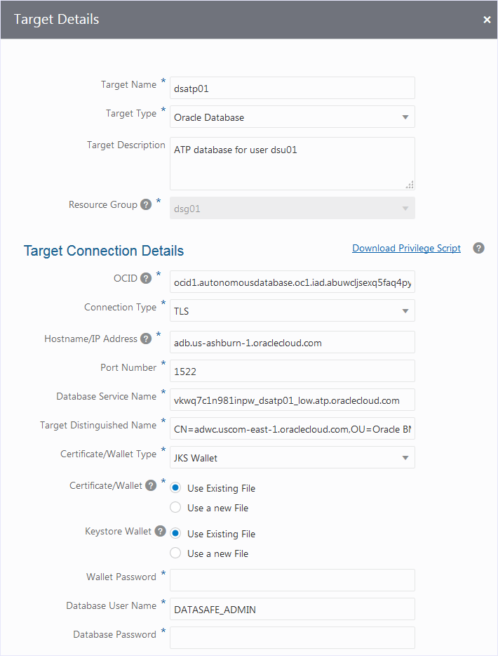

# View a Registered Target Database

## Before You Begin
### Objectives
- Sign in to Oracle Cloud Infrastructure
- Sign in to the Oracle Data Safe Console
- View the Oracle Data Safe dashboard
- View details for a registered target database in Oracle Data Safe

### Requirements
To complete this lab, you need to have the following:
- Login credentials and a tenancy name for the Oracle Cloud Infrastructure Console
- Oracle Data Safe enabled in a region of your tenancy
- A registered target database in Oracle Data Safe

## **STEP 1**: Sign in to Oracle Cloud Infrastructure

- From any browser, enter the following url:

  [https://console.us-ashburn-1.oraclecloud.com/a/tenancy](https://console.us-ashburn-1.oraclecloud.com/a/tenancy)

- In the **Cloud Tenant** field, enter the tenancy name provided to you during the lab, and then click **Continue**.

    

- Under **Oracle Cloud Infrastructure**, enter your **username** and **password**, and then click **Sign In**.

  Be sure to use the correct user name, which is similar to `dsu01`.

  Please do not change your password.

  

## **STEP 2**: Sign in to the Oracle Data Safe Console

- From the navigation menu in Oracle Cloud Infrastructure, select **Data Safe**.

    

- On the Data Safe page, view the list of databases that are registered with Oracle Data Safe. Click **Service Console** to access the Oracle Data Safe Console.

  Each student uses his or her own database. Your database corresponds to your user name. For example, user `dsu01` uses the ATP database named `dsatp01`.

    

- Under **Oracle Cloud Infrastructure**, enter your user name and password, and then click **Sign In**.

  Be sure to use the correct user name, which is similar to `dsu<number>` (for example, `dsu01`), and do not use the **Single Sign-On (SSO)** option.

  

- Bookmark the page so that if you need to sign in again, you can navigate directly to the Oracle Data Safe **SIGN IN** page.

## **STEP 3**: View the Oracle Data Safe Dashboard

- Notice that when you sign in to Oracle Data Safe, you are presented with a dashboard on the **Home** tab.

  The dashboard lets you monitor several activities at once.

  When you first sign in, the charts in your dashboard do not contain data because you have not yet used the features.

    

- View the top tabs.

  They provide quick access to the dashboard (**Home** tab), registered target databases (**Targets** tab), the Oracle Data Safe Library (**Library** tab), reports for all Oracle Data Safe features (**Reports** tab), all of the alerts (**Alerts** tab), and all of the current and scheduled jobs (**Jobs** tab).

  

- View the side tabs.

  They provide quick access to Oracle Data Safe's main features, including **Security Assessment**, **User Assessment**, **Data Discovery**, **Data Masking**, and **Activity Auditing**.

    

## **STEP 4**: View details for a registered target database in Oracle Data Safe

- Click the **Targets** tab. Notice that there is only one target database to which you have access.

  An Oracle Data Safe administrator configured an authorization policy in Oracle Data Safe to grant you access to the resource group that contains your database.

    
 

- Click the name of your target database.

   

- Review the details for your target database.

  Your database is an Autonomous Transaction Processing (ATP) database.

  An Oracle Data Safe administrator registered your Autonomous Database through the Autonomous Transaction Processing (ATP) Console.

  

- Click **Cancel** to close the **Target Details** dialog box.