# Lab 4: Analyzing Alerts and Audit Reports

## Before You Begin
### Objectives
- View and close alerts
- Analyze open alerts from the dashboard
- View all audit records for the past week
- View a summary of audit events collected and alerts raised
- Create a failed logins report

### Requirements
To complete this lab, you need to have the following:
- Login credentials and a tenancy name for the Oracle Cloud Infrastructure Console
- Oracle Data Safe enabled in a region of your tenancy
- A registered target database in Oracle Data Safe with sample data
- Audit collection started on your target database in Oracle Data Safe. If not, see [Lab 2: Provision Audit and Alert Policies](../Lab2/LabGuide2.md)

### Assumptions
This lab assumes that you are signed in to the Oracle Data Safe Console. If not, see [Lab 1: Viewing a Registered Target Database](../Lab1/LabGuide1.md), steps 1 and 2.

Your data values may be different than those shown in the screenshots in this lab.

## **STEP 1**: View and close alerts

- In Oracle Data Safe Console, click the **Home** tab, and then click the **Alerts** tab.

  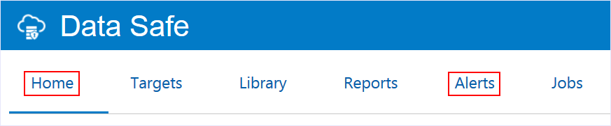

- At the top of the **All Alerts** page, click **Summary**.

  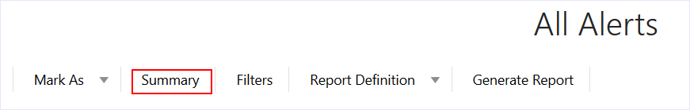

-  View the totals for target databases, critical alerts, high risk alerts, medium risk alerts, and open alerts.

   At a glance, you can better understand whether the security of your database is in jeopardy and how you should prioritize your work.

   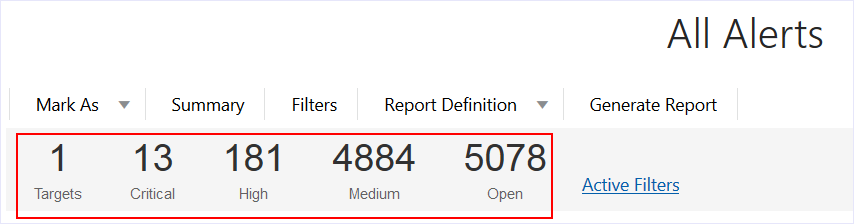

- Scroll down to review the alerts in the table.

  The **DB User** column identifies who is doing the action.

  The **Operation** column identifies the action.

  The **Alert Severity** column indicates how serious the action is.

  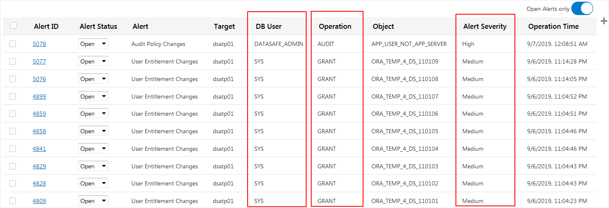

- At the bottom of the page, click the page numbers to view other pages of alerts.

  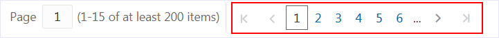

- To filter the report to show only critical alerts, at the top of the report, click **Filters**. Set the filter to be: **Alert Severity = Critical**, and then click **Apply**.

  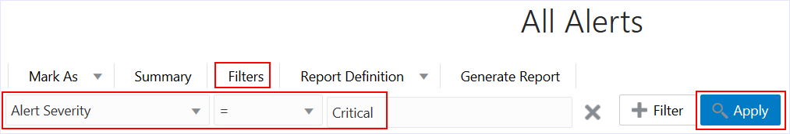

- Position the cursor over the **DB User** column and click the up arrow button to sort the column.

  

- Notice that there are several failed logins by the `DBA_DEBRA` user.

  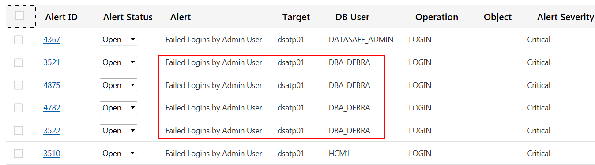

- Click the **Alert ID** for the first failed login alert for `DBA_DEBRA` to view more detail.

  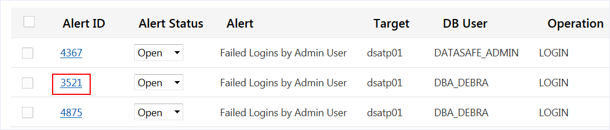

- Review the information in the **Alert Details** dialog box, and then click **X** to close it.

  You can view the **OS User**, **Client Host**, **Client Program**, **Client IP**, **Operation Time**, and much more.

  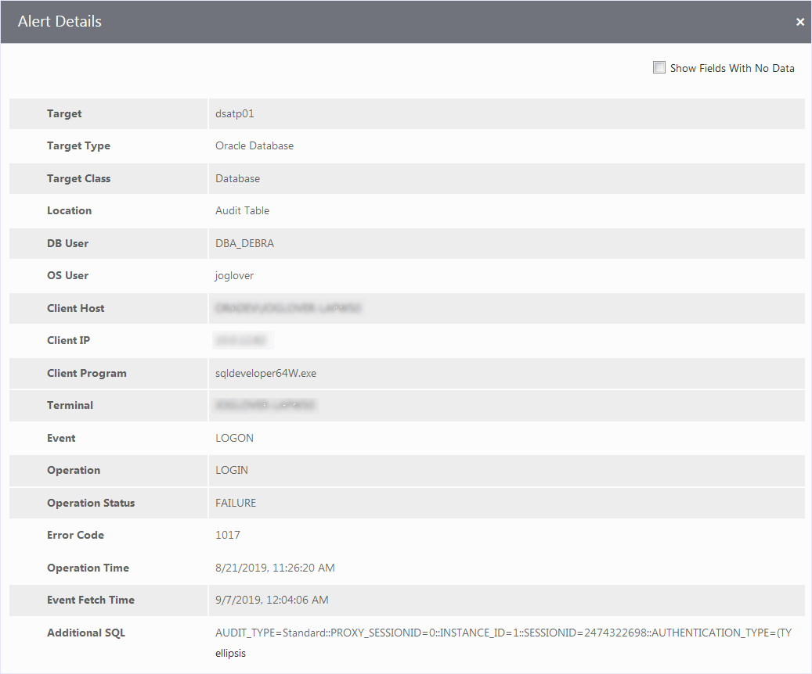

- Click the **X** to remove the filter.

  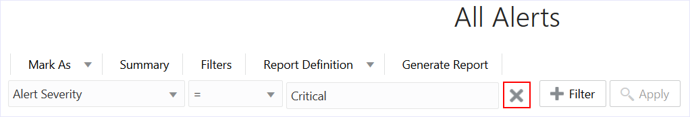

- Create two filters to find out if the user `EVIL_RICH` is making any user entitlement changes.

   To create the first filter, click **+ Filter** and set the filter to be: **Alert = User Entitlement Changes**.

   To create the second filter, click **+Filter**, and set the filter to be: **DB User = EVIL_RICH**. Click **Apply**.

   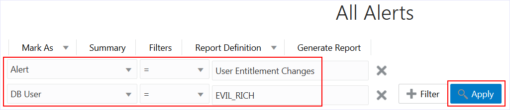

- Notice that there are several alerts. Click the **Alert ID** for the first alert.

  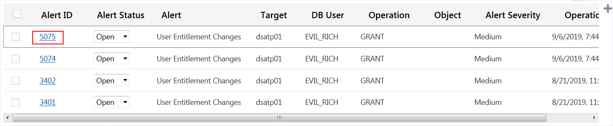

- Scroll down in the **Alert Details** dialog box. Notice that `EVIL_RICH` tried to execute the SQL command: `grant PDB_DBA to ATILLA`, but failed. Close the dialog box.

  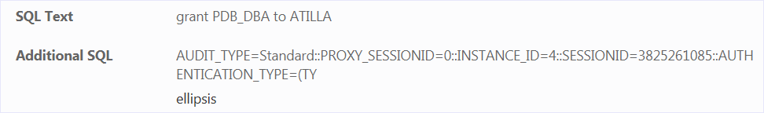

- Open the other **Alert IDs** for `EVIL_RICH`. Notice that the SQL text is similar in that the failed grants are for the `ATILLA` user.

  Suppose you take appropriate action. Now you can close the alerts. To do so, in the **Alert Status** column, select **Closed** for each alert.

  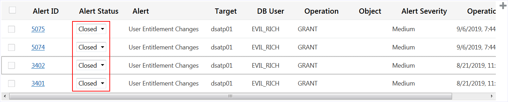

- To hide closed alerts, move the **Open Alerts only** slider to the right.

  

## **STEP 2**: Analyze open alerts from the dashboard

- Click the **Home** tab.

   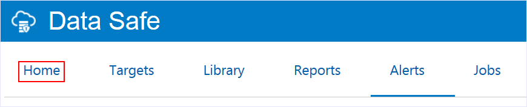

- Review the information in the charts on the dashboard.

  Note: There is no data for Data Discovery and Data Masking because you have not yet used those features.

  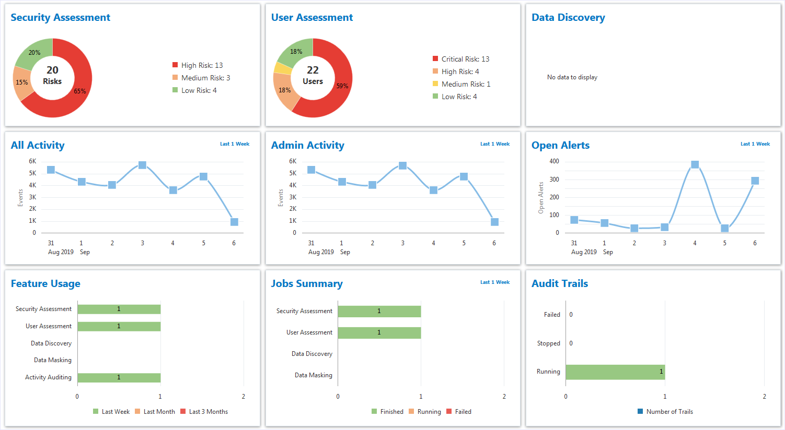

- In the **Open Alerts** chart, notice that the chart shows the number of open alerts for the last 7 days. Click the last node in the chart.

  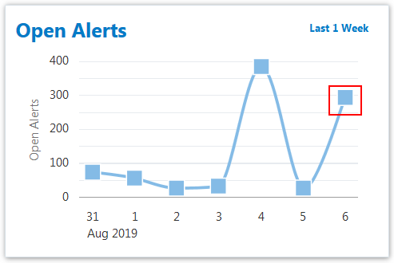

- In the **Open Alerts** dialog box, view the number of open alerts for the last 7 days.

  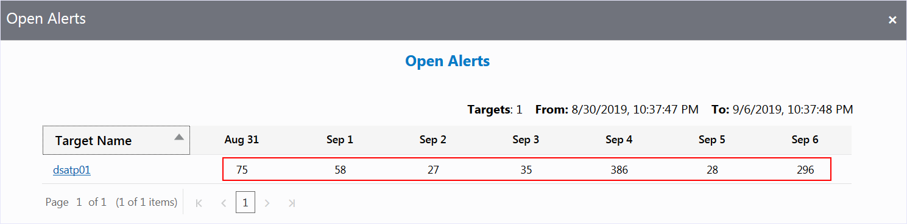

- Hover over the counts to view the number of **Critical**, **High**, and **Medium** alerts for each day.

  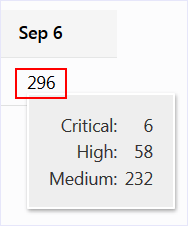

- Click the name of your target database to open the **All Alerts** report.

  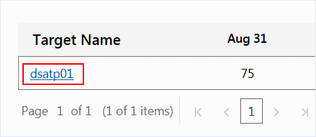

- Notice that the **All Alerts** report is filtered to show only the open alerts for your target database for the past 7 days.

  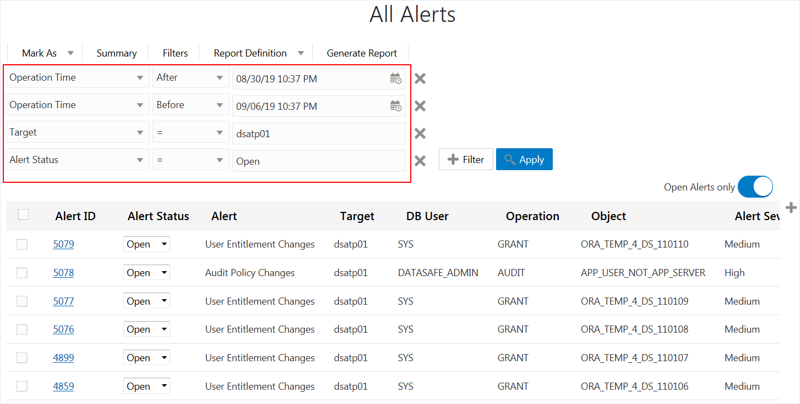

## **STEP 3**: View all audit records for the past week

- Click the **Reports** tab.

  

- On the left, expand **Audit Reports** (if needed), and then click the **All Activity** report.

   

- At the top of the report, view the totals for **Targets**, **DB Users**, **Client Hosts**, **Login Success**, **Login Failures**, **User Changes**, **Privilege Changes**, **DDLs**, and **DMLs**.

  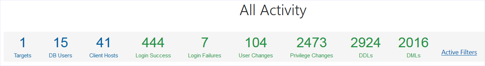

- If the filters are not displayed, click **Filters**.

  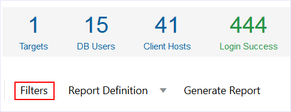

- Notice that the report is automatically filtered to show one week's worth of audit data for your target database.

  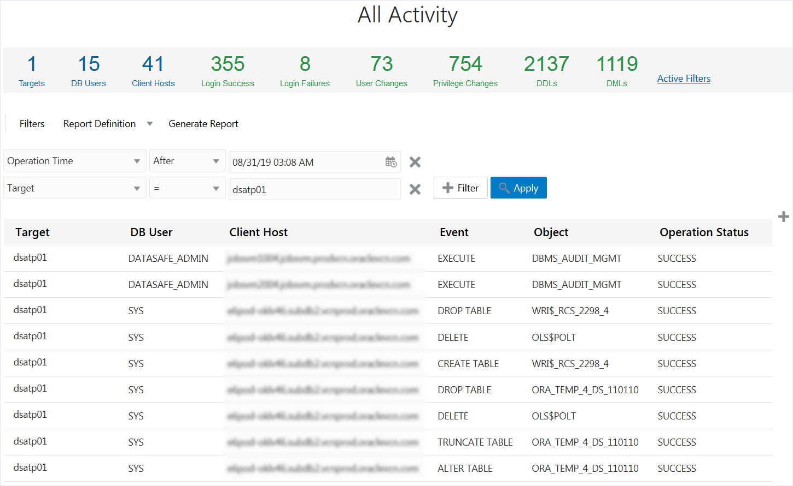

## **STEP 4**: View a summary of audit events collected and alerts raised

- On the left, click **Summary Reports**, and then click **Audit Summary**.

  The **Audit Summary** report helps you to gain an understanding of the activity trends of your target databases. By default, the report shows you data for all of your target databases for the past week.

   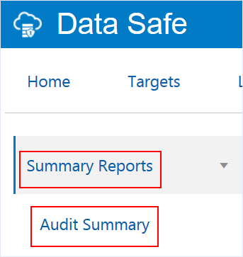

- View the totals to learn how many target databases are represented in the charts, how many users are audited, and how many client hosts have connected to your target database.

  The report is filtered to show data for the last week.

  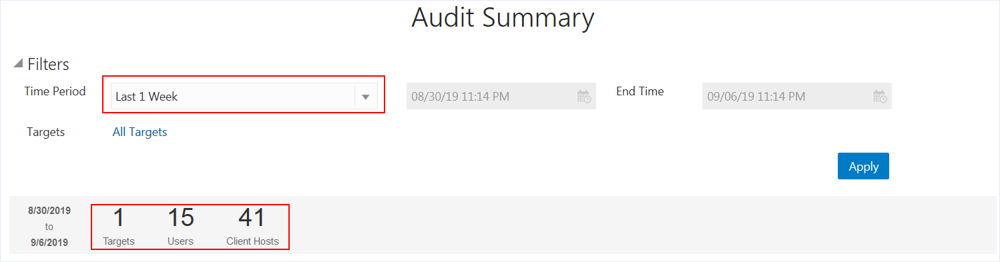

- View the charts.

  The **Open Alerts** chart compares the number of critical, high, and medium open alerts for the past week.

  The **Admin Activity** chart compares the number of logins, database schema changes, audit setting changes, and entitlement changes for the past week.

  The **Login Activity** chart compares the number of failed and successful logins for the past week.

  The **All Activity** chart compares the total number of events for the past week.

   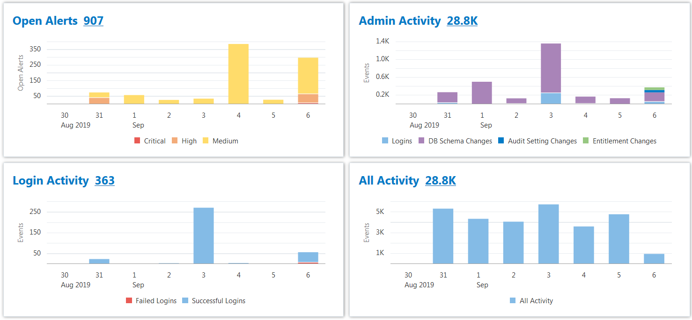

- To filter the time period for the report, at the top, select **Last 1 Month** and click **Apply**.

   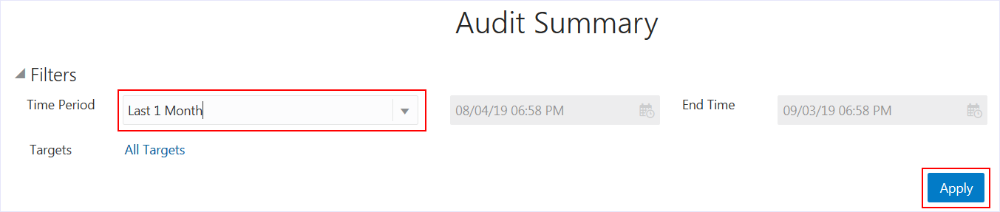

- To filter the target database for the report, click **All Targets**.

  

- In the **Select Targets** dialog box, deselect the check box for **All Targets**, click the field and select your target database, and then click **Done**.

   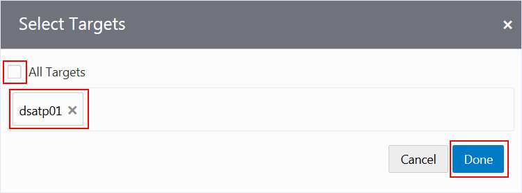

- Notice that your target database is set as a filter.

  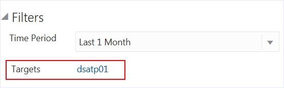

## **STEP 5**: Create a failed logins report

- Click the **Reports** tab.

  

- In the list under **Audit Reports**, click **Login Activity**.

  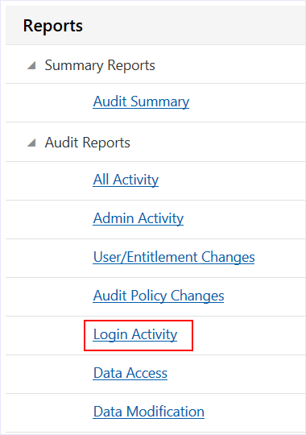

- In the **Login Activity** report, set a filter by selecting **Operation Status = FAILURE** (no quotes). Click **Apply**.

  

- Notice that the report shows only failed logins.

   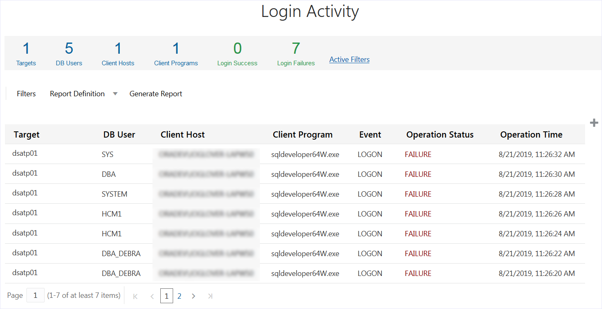

- From the **Report Definition** menu, select **Save As New**.

  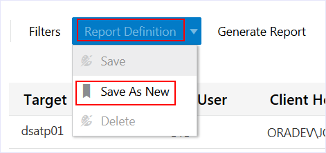

- In the **Save As** dialog box, enter the report name **Failed Logins**, enter **Failed logins report** for the description, select your resource group, and then click **Save As**. A confirmation message states "Successfully created the report."

  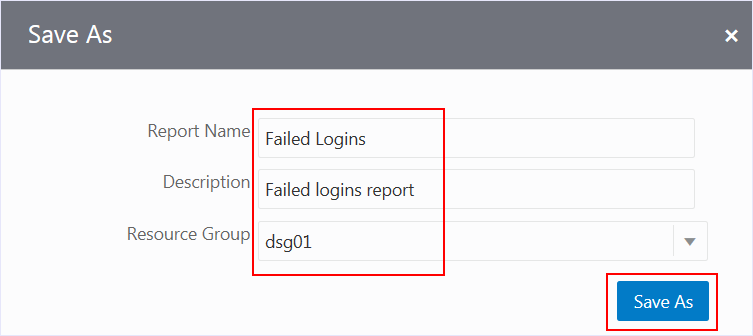

- Click the **Reports** tab.

  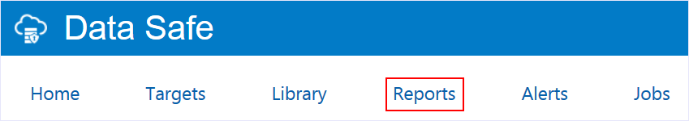

- At the top of the list under **Custom Reports**, click **Failed Logins**.

  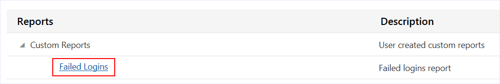

- Click **Generate Report**.

  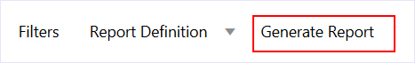

- In the **Generate Report** dialog box, leave **PDF** selected, select your resource group, and then click **Generate Report**.

  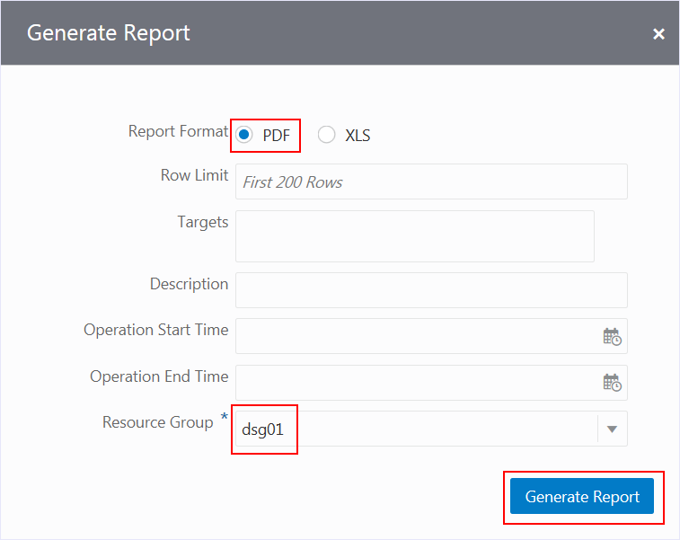

- Wait for a confirmation message that states that the report was generated successfully.

  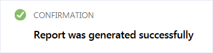

- Click **Download Report**.

  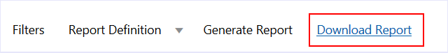

- In the **Opening Failed Logins.pdf** dialog box, click **Save File**, and then click **OK**.

  The PDF is downloaded to your browser.

  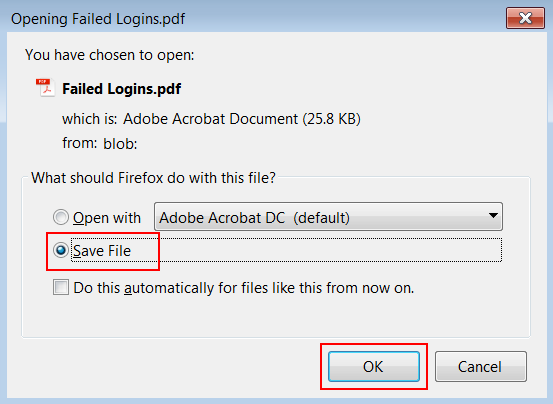

- Click the downloaded **Failed Logins.pdf** file to view it in Adobe Acrobat.

  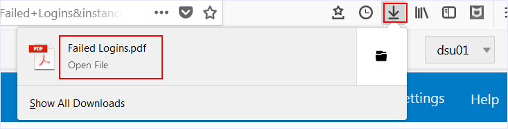

- View the report, and then close it.

  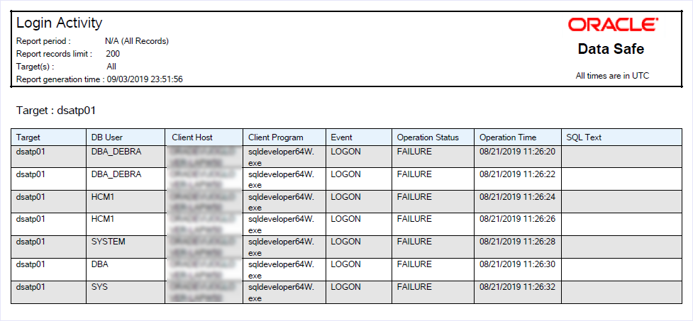