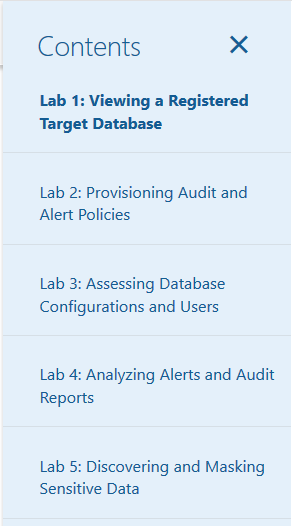

# Oracle Data Safe Workshop
## Welcome

This workshop lets you practice the main features in Oracle Data Safe, including Activity Auditing, Data Discovery, Data Masking, User Assessment, and Security Assessment.

## Access the labs

Use the Contents Menu to access the labs.

If the menu is not diplayed, you can open by clicking the menu button  
.